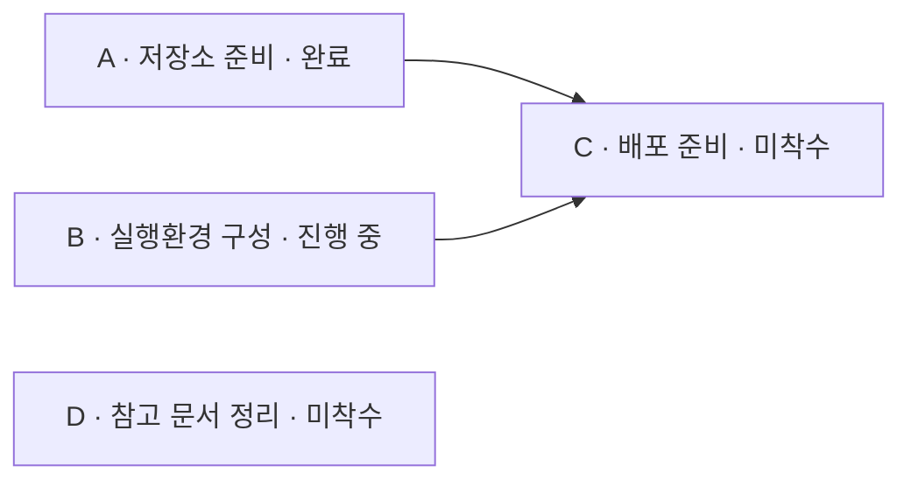
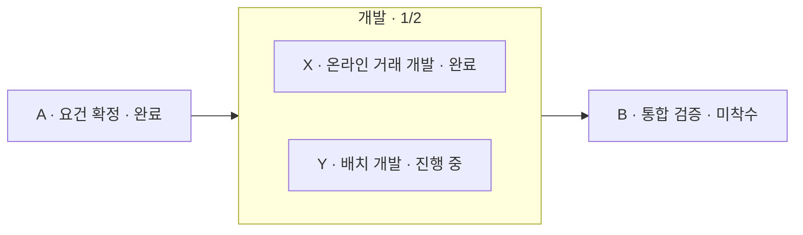

# Tevro — 해결하려는 문제와 제품 요구사항

- 문서 상태: 요구사항 초안. 구현 완료를 의미하지 않음.
- 작성 기준일: 2026-09-26
- 개정일: 2026-10-07 — 검토 결과(요구사항 공백, 대상 Jira 지원 종료) 반영, 공정 계층(포함관계) 요구 추가
- 개정일: 2026-10-08 — ADR-0001 채택(기술 구성), ADR-0002 채택(배포 형태), ADR-0003 채택(SQLite) 반영
- 서비스명: Tevro / 테브로
- 제공 형태: 폐쇄망에 설치하여 사용하는 서버 + 웹 애플리케이션, 동일 서버에 접근하는 CLI
- 문서 목적: 해결하려는 업무상 문제, 사용자에게 제공할 기능, 제품의 경계와 검증 기준을 공유한다.
- 관련 문서: [활용 가능한 오픈소스와 구현 경계](./open-source-components.md), [착수 전 결정 기록(ADR)](./adr/README.md)

> Tevro는 프로젝트에 필요한 공정을 직접 만들고 연결하여, 해야 할 일과 선후관계, 진행 상태를 한눈에 확인하는 도구다. 큰 공정은 세부 공정을 하위로 포함할 수 있다. 반복되는 공정은 템플릿으로 재사용하고, 필요한 경우 Jira 이슈와 연동한다. 사용자는 웹 GUI 또는 CLI를 통해 같은 정보를 관리할 수 있다.

## 1. 제품의 출발점

프로젝트에는 프로그램 개발뿐 아니라 저장소 준비, CI 구성, GitOps 설정, 실행환경 준비, 데이터베이스 작업, 검증, 배포 등 여러 공정이 포함된다. 개발 공정 안에는 온라인 거래 개발, 배치 개발처럼 세부 공정이 있다. 각 공정 중에는 독립적으로 진행할 수 있는 것도 있고, 여러 선행 공정이 준비되어야 진행할 수 있는 것도 있다.

사용자에게 필요한 것은 단순한 이슈 목록이나 일정표가 아니라 다음 질문에 답하는 화면이다.

1. 이번 프로젝트에서 해야 하는 일은 무엇인가?
2. 특정 공정을 진행하려면 어떤 선행 공정이 필요한가?
3. 어떤 공정이 완료됐고, 무엇이 진행 중이거나 아직 시작되지 않았는가?
4. 현재 선행 조건이 갖춰진 공정과 아직 준비되지 않은 공정은 무엇인가?
5. 반복되는 프로젝트에서 이전에 정의한 업무와 관계를 다시 입력하지 않고 사용할 수 있는가?
6. 이 정보를 GUI에서 직접 편집하고, AI 에이전트도 CLI로 조회·수정할 수 있는가?
7. Jira를 사용하는 경우, 같은 일을 두 번 등록하거나 진행 상태를 중복 관리하지 않을 수 있는가?
8. 큰 공정 안의 세부 공정들을 함께 보고, 세부가 모두 끝나면 큰 공정이 끝났다고 볼 수 있는가?

적용 대상은 차세대 시스템 구축에 한정하지 않는다. 신규 서비스 준비, 시스템 이전, 업무 변경, 운영 이관 등 여러 공정과 선후관계를 가진 프로젝트에 공통으로 사용할 수 있어야 한다.

## 2. 해결하려는 업무상 문제

| ID | 현재의 문제 | 구체적인 비효율 또는 위험 |
| --- | --- | --- |
| P-01 | 전체 작업 범위가 이슈와 문서에 분산됨 | 담당자가 여러 목록과 문서를 비교해야 전체 공정을 파악할 수 있고, 등록된 업무 중 미착수·미완료 항목을 놓치기 쉬움 |
| P-02 | 공정 간 선후관계를 개별적으로 확인해야 함 | C를 수행하려면 A와 B가 모두 필요하더라도, 각 이슈를 열거나 담당자에게 문의해야 준비 여부를 알 수 있음 |
| P-03 | 선후관계와 실행 상태를 따로 봐야 함 | A 완료, B 진행 중, C 미착수라는 정보가 있어도 이들이 연결된 이유와 C에 남아 있는 선행 조건을 즉시 이해하기 어려움 |
| P-04 | 독립 공정이 관계 중심 화면에서 빠질 수 있음 | 연결선이 없는 업무가 표시되지 않으면, 전체 작업 범위를 확인하려는 목적을 달성할 수 없음 |
| P-05 | 유사 프로젝트마다 업무와 관계를 다시 작성함 | 표준화된 공정이 있어도 제목·설명·선후관계를 반복 입력하며, 복사 과정에서 항목이나 관계가 누락될 수 있음 |
| P-06 | 작업 절차와 참고 문서 탐색이 반복됨 | 공정 설명, Confluence의 작업 절차, Jira 이슈, 기한 등을 확인하기 위해 여러 화면을 오가야 함 |
| P-07 | 시각 자료와 실제 관리 정보가 분리됨 | 별도로 그린 그림이나 문서가 최신 이슈 상태와 달라져, 그림을 다시 수정하거나 정보를 대조해야 함 |
| P-08 | Jira와 별도 도구의 이중 입력이 발생함 | 설계한 공정을 Jira에 다시 입력하고, 종속성 링크까지 다시 설정하며, 두 시스템의 상태를 각각 확인해야 함 |
| P-09 | GUI 중심의 반복 입력을 자동화하기 어려움 | 여러 공정을 일괄 등록·수정하거나 연결 관계를 검사할 때, AI 에이전트나 스크립트가 사용할 일관된 명령 인터페이스가 필요함 |
| P-10 | 담당 범위와 남은 일정의 파악에 추가 정리가 필요함 | 우리 팀 업무인지 외부 요청이 필요한지, 담당자와 예상 소요 시간은 무엇인지, 어떤 미완료 작업의 기한이 가까운지 별도 목록으로 정리해야 함 |
| P-11 | 큰 공정 안의 세부 공정을 평면 그래프 하나로 표현함 | 전체 구조를 읽기 어렵고, 세부 공정의 완료가 상위 공정의 완료로 이어지는 관계를 따로 관리해야 함 |

### 누락 방지의 한계

Tevro는 등록된 공정과 표준 템플릿을 바탕으로 누락 가능성을 줄인다. 처음부터 템플릿이나 프로젝트에 등록되지 않은 업무의 존재를 자동으로 알아내는 제품은 아니다. 표준 공정의 완전성과 최신성은 사람이 검토해야 한다.

## 3. 목표와 기본 원칙

### 3.1 목표

- 전체 공정, 종속성, 실행 상태를 하나의 화면에서 이해할 수 있게 한다.
- 공정과 연결 관계를 GUI에서 직접 생성·편집할 수 있게 한다.
- 공정을 상위·하위로 묶어 큰 공정과 세부 공정을 함께 관리한다.
- 표준 공정을 템플릿으로 정의하고 프로젝트마다 독립적으로 재사용한다.
- Jira 사용 여부와 무관하게 기본 기능을 사용할 수 있게 한다.
- 필요한 경우 공정과 관계를 Jira 이슈 및 링크로 생성하고, Jira의 상태를 가져온다.
- 모든 사용자 데이터 조작 기능을 CLI로도 제공하여 AI 에이전트가 작업할 수 있게 한다.
- 외부 인터넷 연결 없이 사내 서버와 브라우저만으로 운영할 수 있게 한다.

### 3.2 제품 원칙

1. **그래프는 장식이 아니라 업무 정보의 표현이다.** 노드는 실제 공정이며, 연결선은 실제 선행관계다.
2. **독립 공정도 전체 공정이다.** 연결되지 않은 공정을 숨기지 않는다.
3. **선행 조건과 실행 상태를 구분한다.** 선행 작업이 미완료여도 사용자가 후속 작업을 진행할 수 있다. 미충족 조건은 표시하되 착수나 상태 변경을 강제로 차단하지 않는다.
4. **Jira는 선택적 연동이다.** Jira 설정이나 계정이 없어도 공정 작성·상태 관리·템플릿 재사용이 가능해야 한다.
5. **Confluence, Jira, 데드라인은 필수 입력이 아니다.** 필요한 프로젝트와 공정에만 설정한다.
6. **템플릿과 실제 프로젝트는 독립적이다.** 한 프로젝트를 수정했다고 템플릿이나 다른 프로젝트가 바뀌면 안 된다.
7. **GUI와 CLI의 기능 및 검증 규칙은 같아야 한다.** CLI를 우회 입력 수단이나 별도의 데이터 저장소로 만들지 않는다.
8. **알 수 없는 상태를 완료나 미완료로 단정하지 않는다.** 특히 Jira 조회 실패와 매핑되지 않은 상태는 확인 필요로 구분한다.
9. **자동화보다 가시성을 먼저 제공한다.** 승인·강제 진행 제어·업무 자동 실행 엔진으로 범위를 넓히지 않는다.
10. **구현 범위와 사용 시 선택 여부를 구분한다.** 선택 기능도 제품 요구사항에 포함되지만, 사용자가 설정하지 않았다고 기본 기능이 제한되면 안 된다.
11. **포함관계와 선행관계는 다른 관계다.** 포함은 수직(상위·하위), 선행은 수평(형제 사이)이며 서로 섞지 않는다.

## 4. 주요 사용자와 사용 흐름

### 4.1 주요 사용자

| 사용자                 | 필요한 일                                  |
| ------------------- | -------------------------------------- |
| 프로젝트 담당자            | 전체 공정과 선후관계를 정의하고, 누락·진행 현황을 확인        |
| 개별 공정 수행자           | 본인 공정의 내용, 선행 조건, 관련 문서, 상태와 기한을 확인·수정 |
| 표준 공정 관리 담당자        | 반복되는 공정을 템플릿으로 정리하고 유지                 |
| AI 에이전트 또는 자동화 스크립트 | 사용자가 허용한 범위에서 CLI로 공정과 관계를 조회·편집       |

이 구분은 사용 목적을 설명하는 것이며, 그대로 권한 역할을 확정한 것은 아니다.

### 4.2 대표 흐름

- **새 프로젝트 작성:** 프로젝트 생성 → GUI 또는 CLI로 공정 추가 → 선후관계 연결 → 상태 확인·수정.
- **반복 업무 재사용:** 템플릿 선택 → 새 프로젝트 생성 → 이번 프로젝트에 맞게 공정과 관계 수정 → 독립적으로 진행.
- **준비 상태 점검:** 공정 C 선택 → 선행 공정 A·B 확인 → A 완료, B 진행 중 확인 → C에 필요한 준비 사항 판단.
- **계층 작성:** 큰 공정 '개발' 생성 → 그 아래에 '온라인 거래 개발'·'배치 개발' 추가 → 하위끼리 선후관계 연결 → 하위가 모두 완료되면 '개발'이 자동 완료됨을 확인.
- **Jira 게시:** 대상 Jira 프로젝트·이슈 유형 선택 → 생성할 공정과 관계 미리 보기 → 이슈 생성 → 새 이슈끼리 링크 생성 → 매핑 저장.
- **Jira 현황 확인:** 연결된 이슈 상태 조회 → 그래프 표시 갱신 → 조회 실패나 불일치 별도 표시.
- **에이전트 작업:** CLI로 프로젝트 조회 → 공정과 관계 변경 → 서버 검증 → GUI에서 같은 결과 확인.

## 5. 핵심 개념과 관계 의미

| 개념               | 정의                                                 |
| ---------------- | -------------------------------------------------- |
| 프로젝트             | 실제로 진행하는 한 번의 업무 집합. 공정·종속성·상태를 포함함                |
| 공정 / Task        | 수행할 하나의 업무 단위. 화면의 노드와 대응하며 Jira 이슈와는 별개로 존재할 수 있음 |
| 종속성 / Dependency | 한 공정이 다른 공정의 선행 조건이라는 방향 있는 관계                     |
| 템플릿              | 반복 사용할 공정 정의와 종속성의 묶음. 실제 실행 상태와 분리됨               |
| 템플릿 적용           | 템플릿을 복제하여 독립적인 프로젝트와 공정들을 생성하는 작업                  |
| Jira 매핑          | Tevro 공정과 특정 Jira 사이트의 특정 이슈 사이의 연결 정보             |
| 실행 상태            | 공정 자체의 미착수·진행 중·완료 여부                              |
| 선행 조건 충족 여부      | 선행 공정들의 상태를 바탕으로 계산한 준비 정보. 실행 상태와 별도임             |
| 포함관계 / 상위 공정     | 한 공정이 다른 공정들을 세부 공정으로 포함하는 수직 관계. 공정은 상위 공정을 최대 하나 가지며, 선행관계와는 별개의 관계임 |
| 말단 공정            | 하위 공정이 없는 공정. 상태 요약(F-S05)의 집계 기준                      |

### 5.1 연결 방향

`A → C`는 **A가 C의 선행 공정**이라는 뜻이다. 초기 관계 모델은 선행 공정의 완료를 기준으로 판단한다. 단순 참고 관계, 시작-시작 관계, 시차 조건 등 여러 일정 관계를 함께 도입하지 않는다.

A와 B가 모두 C에 연결되면 C의 선행 조건은 A와 B의 완료를 모두 요구한다. 둘 중 하나만 완료하면 되는 OR 조건은 초기 모델에 포함하지 않는다.



위 예시에서 D도 반드시 화면에 표시한다. C는 선행 공정 B가 미완료임을 보여주되, 사용자가 C를 진행 중으로 바꾸는 행위를 차단하지 않는다.

### 5.2 DAG와 병행 가능성

자기 자신을 향하는 연결, 중복 연결, 순환을 만드는 연결은 허용하지 않는다. 공정들은 각 층 안에서 여러 개의 분리된 그래프를 이룰 수 있고, 시작점이나 종료점이 하나일 필요도 없다. 층의 뜻은 §5.3에서 정의한다.

두 공정 사이에 선후 경로가 없으면 종속성상 병행할 수 있는 후보로 볼 수 있다. 다만 담당자나 자원 부족 등 그래프에 없는 제약까지 없다는 의미는 아니다. 단계나 분류가 같다는 이유로 의존성을 자동 생성하지 않는다.

### 5.3 포함관계와 계층

공정은 다른 공정들을 하위 공정으로 포함할 수 있다. 예를 들어 '개발' 공정 안에 '온라인 거래 개발', '배치 개발'이 있다. 선행관계(→)가 수평 차원이라면 포함관계는 수직 차원이다. 두 관계는 별개이며, 종속성 데이터에 섞지 않고 공정에 선택적인 상위 공정 ID를 둔다(§7.1). 아래 규칙은 2026-10-07에 사용자가 확정한 요구(§6.9)를 개념으로 정리한 것이다.

| 규칙 | 내용 |
| --- | --- |
| 트리 | 공정은 상위 공정을 최대 하나 가진다. 상위는 같은 프로젝트의 공정이어야 하고, 자기 자신이나 자손은 상위가 될 수 없다. 깊이 제한은 모델에 두지 않는다 |
| 층 | 같은 상위를 가진 공정들(형제)이 한 층을 이룬다. 상위가 없는 최상위 공정들도 서로 형제다 |
| 형제 간 선행 | 선행관계는 같은 층의 공정끼리만 맺는다. 다른 층의 공정을 연결하려는 시도는 거부한다(F-H03) |
| 층별 DAG | 각 층은 독립된 작은 DAG다. 순환 검사는 층마다 따로 한다. 포함관계는 트리라 순환이 생길 수 없다 |
| 상속 | 상위에 맺은 선행관계는 하위 전부에 상속된다. 'A → 개발'이면 개발의 모든 하위는 A의 완료를 선행 조건으로 가진다. '개발 → B'이면 B의 선행 조건은 개발의 완료, 곧 개발의 하위 전부의 완료다(F-H04). 판정은 개발의 실행 상태로 하며, 수동 변경(F-H06)으로 하위와 어긋난 경우는 모순으로만 표시한다(§6.4) |
| 완료 전이 | 하위가 모두 완료되는 순간 상위를 완료로 자동 변경한다. 상위를 사용자가 직접 바꾸는 것도 허용하고, 어긋남은 막지 않고 표시한다(F-H05, F-H06) |
| 표시 | 화면은 한 번에 한 층을 보여 준다. 접힌 상위 공정에는 하위 개수와 완료 수(예: 3/5)를 표시하고, 접힌 상태에서는 상위 사이의 선행관계만 보인다. 펼치면 그 안의 DAG가 보인다(F-H07) |

'3차원'은 설명을 위한 비유다. 실제 3D 렌더링은 범위 밖이다(§9).



위 예시에서 X와 Y는 개발의 하위 공정이고, 선행관계는 X·Y 사이에만 맺을 수 있다. A → 개발이 있으므로 X와 Y는 A의 완료를 상속받은 선행 조건으로 가진다. B의 선행 조건은 개발의 완료이며, 개발은 X·Y가 모두 완료될 때 자동으로 완료된다. 접힌 상태에서는 A → 개발 → B만 보이고, 개발을 펼치면 X·Y가 보인다.

## 6. 전체 사용자 기능

아래 기능은 전체 제품 범위다. 초기 구현 대상, 선택적 사용 기능, 이후 확장 대상은 11장에서 별도로 구분한다. 기능 ID는 논의와 구현·검증을 연결하기 위한 식별자다.

### 6.1 프로젝트와 공정 관리

| ID    | 기능         | 사용자 관점의 요구사항                                                                   |
| ----- | ---------- | ------------------------------------------------------------------------------ |
| F-P01 | 프로젝트 생성·조회 | 프로젝트 이름과 선택적 설명을 등록하고, 목록에서 해당 프로젝트를 열 수 있음                                    |
| F-P02 | 프로젝트 정보 수정 | 프로젝트 이름과 설명을 수정할 수 있음                                                          |
| F-P03 | 공정 생성      | GUI에서 노드를 추가하거나 CLI로 공정을 등록할 수 있음. 제목 이외의 부가 정보는 필요한 범위에서만 입력. 상위 공정 지정은 F-H01 |
| F-P04 | 공정 내용 편집   | 제목과 상세 설명을 편집할 수 있고, 여러 줄의 작업 절차·완료 기준 등을 설명에 기록할 수 있음                         |
| F-P05 | 요약·상세 보기   | 그래프에서는 핵심 정보를 간략히 보고, 공정을 선택하면 전체 설명과 부가 정보를 확인할 수 있음                          |
| F-P06 | 공정 삭제      | 공정 삭제 시 관련 연결과 Jira 매핑에 미치는 영향을 확인할 수 있음. Tevro에서 삭제했다고 실제 Jira 이슈를 자동 삭제하지 않음 |
| F-P07 | 공정 조회      | 제목 또는 식별자로 공정을 찾고, 프로젝트 안의 공정 목록을 조회할 수 있음                                     |
| F-P08 | 지속적 저장     | 공정과 관계·상태를 저장하고, 브라우저나 서버를 다시 열어도 동일한 프로젝트를 이어서 관리할 수 있음                       |

별도 체크리스트 필드, 댓글 시스템, 첨부파일 관리까지 초기 제품에 포함하지 않는다. 상세 작업 절차는 우선 공정 설명과 Confluence 링크로 제공한다.

프로젝트 삭제·보관 기능은 아직 정의하지 않았다. F-P01·F-P02는 생성·조회·수정만 다루고, 삭제는 공정(F-P06)과 템플릿(F-T10)에만 있다. 설치형 서버를 오래 운영하면 끝난 프로젝트와 실수로 만든 프로젝트가 쌓인다. 보관·삭제를 제공할지, 삭제할 때 Jira 매핑과 반영 결과를 어떻게 처리할지, CLI 동등성(F-C01) 대상인지는 결정이 필요하다(§13-14).

F-P06의 삭제 영향에는 끊기는 선후 경로도 있다. A → B → C에서 B를 삭제하면 연결 A → B와 B → C가 함께 사라지고, A와 C 사이의 순서 정보도 남지 않는다. 템플릿 적용 후 불필요한 공정을 제외하는 경우(F-T07)도 초기 범위에서는 삭제이므로 같은 일이 생긴다. 사용자는 삭제 후 A → C를 직접 다시 연결할 수 있다. 삭제할 때 A → C 연결을 자동으로 제안하거나 만들어 줄지는 UX 설계 선택이며 미정이다. 변경 이력은 후속 검토 대상(F-M08)이므로 잘못 삭제한 공정을 되살리는 수단은 현재 백업(N-04)뿐이다. CLI 단건 삭제(`task delete`)는 F-C07 확인 대상에 명시되어 있지 않다. F-C06이 변경 대상과 영향을 명확하게 지정하도록 요구하지만, 연결이나 Jira 매핑이 있는 공정을 삭제할 때 명시적인 실행 의사를 받을지는 정해지지 않았다(§13-15). 하위 공정이 있는 공정의 삭제는 §6.9 '상위 변경과 삭제'와 §13-15에서 다룬다.

### 6.2 종속성 생성·편집

| ID | 기능 | 사용자 관점의 요구사항 |
| --- | --- | --- |
| F-D01 | GUI 연결 생성 | 공정 A와 B를 연결하여 A가 B의 선행 공정임을 설정할 수 있음 |
| F-D02 | 연결 변경·삭제 | 잘못된 연결을 삭제하거나 방향·연결 대상을 수정할 수 있음 |
| F-D03 | 다중 선행·후속 | 한 공정에 여러 선행 공정과 여러 후속 공정을 연결할 수 있음 |
| F-D04 | 구조 검증 | 자기 참조, 중복 연결, 존재하지 않는 공정 참조, 순환 종속성을 거부하고 이유를 알려줌(다른 층 공정 간 연결 거부는 F-H03) |
| F-D05 | 선행·후속 조회 | 특정 공정의 직접 선행·후속 공정을 확인하고, 전체 경로를 따라 영향 범위를 파악할 수 있음 |
| F-D06 | 동일한 서버 검증 | GUI, CLI, 템플릿 적용 등 어떤 입력 경로에서도 동일한 DAG 검증을 수행함 |

초기 종속성은 같은 프로젝트 안, 그중에서도 같은 상위 안의 공정(형제) 사이에 정의한다(§5.3, F-H03). 프로젝트를 가로지르는 연결은 이후 검토 대상으로 둔다.

### 6.3 DAG 시각화

| ID | 기능 | 사용자 관점의 요구사항 |
| --- | --- | --- |
| F-G01 | 전체 공정 표시 | 연결된 공정뿐 아니라 독립 공정과 완료된 공정도 기본 화면에 표시. 접힌 상위 공정 안의 하위는 펼쳐야 보이되, 접힌 상위에 하위 개수·완료 수를 표시해 누락되지 않게 함(F-H07) |
| F-G02 | 방향 구분 | 선행에서 후속으로 향하는 방향을 화살표 등으로 명확하게 표시 |
| F-G03 | 상태 표시 | 각 노드에서 실행 상태를 바로 확인. 색만이 아니라 텍스트나 아이콘도 함께 사용 |
| F-G04 | 탐색 | 화면 이동·확대·축소·전체 보기로 그래프를 탐색할 수 있음 |
| F-G05 | 기본 배치 | 공정 간 관계를 읽을 수 있는 초기 배치와 다시 정렬하는 기능 제공. 구체적인 배치 알고리즘은 미정 |
| F-G06 | 선택 공정 강조 | 선택한 공정과 관련 선행·후속 관계를 식별하고 상세 정보로 이동 |
| F-G07 | 선택 정보 표시 | 설정된 경우에만 데드라인, Jira 키, 문서 링크 등의 요약 정보를 표시 |

Mermaid와 유사한 방향성 그래프를 원하는 것이며, Mermaid 문법 편집을 사용 전제로 삼지 않는다. GUI 편집을 위해 Mermaid를 반드시 구현 기술로 사용할 필요도 없다. Mermaid 내보내기는 후속 편의 기능 후보이지 초기 필수 기능은 아니다.

### 6.4 실행 상태와 선행 조건

| ID | 기능 | 사용자 관점의 요구사항 |
| --- | --- | --- |
| F-S01 | 기본 실행 상태 | 미착수, 진행 중, 완료 상태를 제공 |
| F-S02 | 수동 상태 변경 | Jira가 상태 원본이 아닌 공정의 상태를 GUI와 CLI에서 변경하고, 필요하면 완료 상태도 되돌릴 수 있음 |
| F-S03 | 선행 조건 표시 | 각 공정의 선행 조건 충족 여부와 미완료 선행 공정 목록을 확인할 수 있음 |
| F-S04 | 비강제 진행 | 선행 공정이 미완료여도 후속 공정을 착수·완료할 수 있음. 모순 가능성은 알리되 상태를 강제로 바꾸지 않음 |
| F-S05 | 상태 요약 | 전체 공정 수와 상태별 수를 확인하고, 남은 공정을 조회할 수 있음. 집계는 말단 공정 기준(F-H09). 단순 개수 비율을 실제 노력 기반 진척률로 표현하지 않음 |
| F-S06 | 확인 필요 구분 | 외부 상태를 확인할 수 없거나 매핑이 없을 때, 정상 조회한 실행 상태와 구분 |

상태와 준비 정보는 예를 들어 다음처럼 동시에 표현할 수 있다.

```text
공정 C
  실행 상태: 진행 중
  선행 조건: 미충족
  미완료 선행 공정: B
```

상위·하위가 있는 경우의 예시는 다음과 같다.

```text
공정 개발 (하위 공정 3개)
  실행 상태: 진행 중
  하위 완료: 2/3
  선행 조건: 충족
  직접 선행 공정: A (완료)

공정 Z (개발의 하위)
  실행 상태: 미착수
  선행 조건: 충족
  형제 선행 공정: 없음
  상속받은 선행 공정: A (개발의 선행, 완료)
```

하위 공정의 선행 조건 판정은 자기 형제 선행과 조상들이 상속받은 선행을 함께 본다. 위 예시에서 Z의 선행 조건은 형제 선행(없음)과 개발이 A로부터 받은 선행을 합친 것이다. 상위 공정 자체의 선행 조건 판정은 기존 규칙(직접 선행의 완료) 그대로다. 상위를 선행으로 둔 공정(개발 → B)의 선행 조건은 상위의 완료다(§5.3, F-H04). 판정은 상위의 실행 상태가 완료인지로 한다. 하위 전부 완료는 자동 완료(F-H05)로 보통 이와 같아지고, 수동 변경(F-H06)으로 어긋나면 모순으로만 표시하며 판정 기준을 바꾸지 않는다.

선행 공정이 없는 경우 선행 조건은 충족된 것으로 보되, 업무의 실행 가능성을 완전히 보장하는 판정으로 표현하지 않는다. 확인할 수 없는 선행 상태가 있으면 충족으로 단정하지 않는다.

'확인 필요'(F-S06, F-J12)는 F-S01의 세 실행 상태에 더해지는 네 번째 값이 아니라, 조회한 상태를 얼마나 믿을 수 있는지에 대한 별도 표시로 읽는다. 예를 들어 '확인 필요(마지막 확인: 완료, 조회 시각)'처럼 마지막 확인 상태와 함께 보여 주면 원칙 8과 AC-12를 함께 만족한다. F-S06의 '매핑이 없을 때'도 F-J12와 같이 Jira 상태 매핑이 없는 경우로 읽는다. Jira에 연결하지 않은 공정은 원본 원칙(§6.7)대로 Tevro에서 직접 관리한다. 이 해석은 2026-10-07 검토 의견이며, 화면과 데이터 표현은 구현 전에 확정한다.

같은 이유로 선행 조건 판정에는 충족·미충족 외에 '판정 불가' 결과가 필요하다. 상태를 확인할 수 없는 선행 공정이 있으면 충족으로 단정할 수 없고(위 문단), 미완료로 단정할 수도 없다(원칙 8). 이 경우는 Jira 상태 연동을 쓰는 단계에서만 생긴다. 수동 상태만 쓰는 초기 핵심에서는 생기지 않는다. 확인 필요 공정을 F-S05 상태별 집계와 F-M04 지연 판정에서 어떻게 셀지는 결정이 필요하다(§13-8).

### 6.5 선택 정보: Confluence, 데드라인 및 기타 업무 정보

| ID | 기능 | 사용자 관점의 요구사항 |
| --- | --- | --- |
| F-M01 | Confluence 링크 | 공정에 관련 페이지 URL을 선택적으로 등록·수정·제거하고, GUI에서 해당 페이지를 열 수 있음 |
| F-M02 | 독립적인 링크 사용 | Confluence API 연동, 내용 수집, 별도 인증을 요구하지 않고 링크만으로 사용 가능. 페이지 열람 권한은 Confluence에서 관리 |
| F-M03 | 데드라인 | 공정별 완료 기한을 선택적으로 등록·수정·제거하고 표시 |
| F-M04 | 기한 확인 | 기한이 지난 미완료 공정을 식별하고, 미완료 공정을 데드라인순으로 조회. 기한이 없는 공정도 누락 없이 별도 구분 |
| F-M05 | 담당팀·담당자 | 이전 업무관리 요구의 확장 항목. 공정의 담당팀과 담당자를 기록·표시 |
| F-M06 | 내부·외부 업무 구분 | 이전 업무관리 요구의 확장 항목. 우리 팀 수행인지 다른 팀·외부에 요청해야 하는 일인지 기록 |
| F-M07 | 예상 소요 시간 | 이전 업무관리 요구의 확장 항목. 이미 알려진 예상 소요 시간 또는 리드타임을 단위와 함께 기록 |
| F-M08 | 수행 기록과 절차 | 설명·문서 링크로 방법과 완료 기준을 제공. 별도 수행 기록 필드와 체계적인 변경 이력은 이후 확장 여부 검토 |

F-M05~F-M08은 초기 최소 기능을 늘리기 위한 필수 항목이 아니라, 이전에 제기된 업무상 요구를 빠뜨리지 않기 위해 별도로 보존한다. 데드라인의 날짜·시각 정밀도와 시간대 규칙은 구현 전 확정한다.

### 6.6 템플릿 정의와 재사용

| ID | 기능 | 사용자 관점의 요구사항 |
| --- | --- | --- |
| F-T01 | 템플릿 작성 | 이름·설명과 함께 공정 및 종속성을 GUI와 CLI로 정의 |
| F-T02 | 프로젝트에서 추출 | 기존 프로젝트의 공정 정의와 관계를 템플릿으로 저장 |
| F-T03 | 템플릿 편집 | 공정 내용·연결을 수정하며, 프로젝트와 동일한 DAG 검증 적용 |
| F-T04 | 새 프로젝트 생성 | 템플릿을 선택하여 새 프로젝트의 공정과 관계를 함께 생성 |
| F-T05 | 독립적인 식별자 | 새 공정에는 새로운 식별자를 부여하고, 종속성도 새로 생성한 공정끼리 연결 |
| F-T06 | 실행 정보 초기화 | 완료·진행 상태, 실제 Jira 이슈 매핑, 동기화 결과 등 이전 실행 정보를 가져오지 않음 |
| F-T07 | 프로젝트별 수정 | 적용 후 공정 추가·내용 수정·관계 변경·불필요한 공정 제외가 가능하며 원본과 다른 프로젝트에는 영향 없음 |
| F-T08 | 템플릿 변경의 격리 | 템플릿 수정이 진행 중인 프로젝트를 자동 변경하지 않음 |
| F-T09 | 출처 확인 | 어떤 템플릿 정의로 프로젝트를 만들었는지 확인할 수 있도록 출처와 적용 당시 정의를 식별할 정보 보존 |
| F-T10 | 목록·조회·관리 | 저장된 템플릿을 조회·선택하고 수정·삭제할 수 있음. 템플릿 삭제가 이미 생성된 프로젝트를 삭제하지 않음 |

#### 복제 규칙

- 복제 대상: 공정 제목, 설명, 종속성, 포함관계(상위·하위 구조), 재사용 가능한 참고 문서 링크. 포함관계는 새 ID로 복제하고, 프로젝트에서 추출(F-T02)할 때도 그대로 저장한다(F-H10).
- 참고 문서 링크: 어떤 링크가 '재사용 가능'한지 판정할 기준이 아직 없다. 공정당 링크가 하나인지 여러 개인지도 F-M01('관련 페이지 URL'), §7.1('문서 링크'), F-G07('문서 링크 등')에서 확정되지 않았다. 링크 개수와 재사용 여부 판단 방식(모두 복제, 모두 제외, 사용자 선택 등)은 결정이 필요하다(§13-9).
- 초기화 대상: 공정 실행 상태, Jira 이슈 키·ID와 매핑, 동기화 시간·오류, 이전 실행 결과.
- 데드라인: 과거 프로젝트의 절대 날짜를 무조건 복제하지 않는다. 초기에는 비워 두고 프로젝트별로 설정하는 방식을 제안한다.
- 담당자·예상 소요 시간: 해당 확장 기능을 도입할 때 복제 여부를 명시적으로 정한다.
- 시작일 기준 상대 기한, 여러 템플릿 합성, 템플릿 변경을 기존 프로젝트에 선택적으로 병합하는 기능은 초기 범위에 포함하지 않는다.
- 제외 공정을 단순 삭제하는 대신 ‘해당 없음 + 사유’로 남기는 방식은 누락과 의도적 제외를 구분하기 위한 후속 설계 후보다. 기본 실행 상태에 확정 추가한 것은 아니다.

### 6.7 Jira 선택 연동

#### 대상 Jira 환경

사용자가 설명한 연동 대상은 사내 설치형 Jira 9.15.1이다. 실제 에디션(Server/Data Center), 인증 방식, 사이트 설정은 아직 확인하지 않았다(§13-6).

Atlassian 공식 정책에서 확인한 지원 일정은 다음과 같다.

| 항목 | 일자 | 의미 |
| --- | --- | --- |
| Jira Software 9.15 지원 종료 | 2026-03-27 | 이 문서 작성 기준일(2026-09-26)에 이미 지원이 끝난 버전 |
| Jira Data Center 신규 판매 종료 | 2026-03-30 | 신규 구매 불가. 기존 고객의 확장 구매는 2028-03-30까지 |
| Jira Data Center 제품군 EOL | 2029-03-28 | 이후 읽기 전용으로 전환 |

출처: [Atlassian End of Support Policy](https://confluence.atlassian.com/support/atlassian-end-of-support-policy-201851003.html), [Atlassian Data Center end of life](https://www.atlassian.com/licensing/data-center-end-of-life)

Tevro를 개발하는 도중에 사내 Jira가 업그레이드되거나 다른 형태로 이전될 수 있다. 버전이 바뀌면 사용할 수 있는 SDK와 인증 방식도 함께 달라질 수 있다. 사내 Jira 관리자에게 업그레이드·이전 계획(대상 버전과 시점)을 확인해야 한다(§13-6). Jira 접근은 어댑터 경계 뒤에 두는 방식을 제안한다([오픈소스와 구현 경계 §6.3](./open-source-components.md)). 이 경계가 있으면 버전 변경의 영향을 어댑터 안으로 줄이고 공정·템플릿 규칙까지 번지지 않게 할 수 있다. EOL 이후 읽기 전용 전환은 해당 Jira를 대상으로 한 이슈·링크 생성(F-J05~F-J08)의 사용 기간에도 영향을 준다.

Jira는 선택 연동(원칙 4)이므로 이 일정이 기본 기능의 착수를 막지는 않는다. 폐쇄망 환경이라 Cloud로 이전할 가능성은 낮다고 보지만, 이 역시 사내 확인 사항이다.

#### 기존 이슈 연결 및 신규 생성

| ID | 기능 | 사용자 관점의 요구사항 |
| --- | --- | --- |
| F-J01 | 연동 설정 | 사내 Jira 주소와 인증 정보를 설정하고 연결·권한을 확인. 설정하지 않아도 기본 기능 사용 가능 |
| F-J02 | 기존 이슈 연결 | 공정에 기존 Jira 이슈의 키 또는 URL을 지정하여 연결 |
| F-J03 | 이슈 정보 표시 | 연결된 이슈의 키·제목·상태를 확인하고 Jira 화면으로 이동 |
| F-J04 | 연결 해제 | Tevro의 매핑만 해제할 수 있음. 실제 Jira 이슈나 다른 사용자의 링크를 자동 삭제하지 않음 |
| F-J05 | 공정 하나를 이슈로 생성 | 공정 제목·내용을 바탕으로 선택한 기존 Jira 프로젝트에 새 이슈를 생성하고 매핑 저장 |
| F-J06 | 여러 공정을 이슈로 생성 | 선택한 공정 또는 전체 미연결 공정을 일괄 생성. 독립 공정도 생성 대상에 포함 |
| F-J07 | 생성 항목 확인 | 대상 프로젝트, 이슈 유형, 필수 필드, 생성 대상과 이미 연결된 항목을 실행 전에 확인 |
| F-J08 | 종속성 링크 생성 | 공정 간 방향 있는 종속성을 생성된 Jira 이슈 또는 이미 매핑된 이슈 사이의 링크로 반영 |
| F-J09 | 개별 결과 확인 | 공정별 이슈 생성 결과와 관계별 링크 생성 결과를 구분하여 표시 |

이 기능은 **기존 Jira 프로젝트 안에 이슈를 생성하는 기능**이다. Jira 프로젝트 자체를 새로 만드는 관리 기능과 구분한다. 기존 이슈 전체를 JQL로 가져와 Tevro 프로젝트를 구성하는 기능은 별도 확장 대상으로 둔다.

#### Jira 인증 주체 — 결정 필요

F-J01은 '인증 정보를 설정'한다고만 정한다. Tevro 서버가 공용 서비스 계정 하나로 Jira에 접근할지, 사용자별 개인 액세스 토큰을 쓸지 결정이 필요하다(§13-6).

| 방식 | 영향 |
| --- | --- |
| 공용 서비스 계정 | Jira 권한이 없는 Tevro 사용자도 F-J03으로 이슈 제목·상태를 보게 되어 Jira 권한을 우회할 수 있음. Tevro가 생성한 이슈와 링크의 작성자가 모두 서비스 계정이 됨 |
| 사용자별 개인 액세스 토큰 | 서버가 사용자마다 인증값을 분리 보관해야 함(F-C09, §7.2). 같은 이슈라도 사용자마다 조회 결과가 달라질 수 있어, 공유 저장되는 상태 조회 정보(§7.1)를 누구 기준으로 남길지 정해야 함 |

CLI로 작업하는 에이전트가 Jira를 호출할 때 누구의 자격을 쓰는지도 이 결정에 따른다. 연동 대상 Jira 사이트를 하나로 한정할지도 함께 정한다.

#### 링크 의미와 재시도

- Tevro의 `A → B`는 Jira에서도 ‘A가 B의 선행 조건’이라는 의미를 유지해야 한다. 표시 이름만이 아니라 실제 링크 방향을 검증한다.
- 사용할 Jira 링크 유형은 사이트 설정에 맞게 선택·매핑한다. 특정 영문 이름이 모든 사이트에 존재한다고 가정하지 않는다.
- 양쪽 공정의 Jira 매핑이 확보된 이후에 링크를 생성한다. 한쪽 생성에 실패했다면 해당 관계를 완료로 표시하지 않는다.
- 이미 Jira에 연결된 공정에는 새 이슈를 중복 생성하지 않는다.
- 성공한 이슈·링크와 실패한 항목을 저장하여, 재시도 시 성공한 작업을 무조건 반복하지 않는다.
- 요청 시간 초과 등으로 Jira에는 생성됐지만 응답을 받지 못한 경우를 별도로 다룬다. 결과 미확인 상태를 표시하고 중복 생성 전에 확인·복구할 수 있어야 한다.
- 여러 이슈와 링크 생성 전체가 하나의 원자적 작업이라고 가정하지 않는다. 부분 성공 상태를 사용자에게 정확하게 알린다.
- Tevro에서 연결을 제거했다고 Jira의 해당 링크를 자동 삭제하지 않는다. 이후 삭제 동기화를 지원한다면 Tevro가 관리하는 관계와 사용자가 직접 만든 관계를 구분하고 영향을 먼저 보여준다.

다음은 2026-10-07 검토에서 추가한 설계 제안이다. 확정된 규칙이 아니다.

- 한 Jira 이슈에 같은 프로젝트의 공정 둘이 매핑되어 있으면, 두 공정 사이의 관계를 F-J08로 반영할 때 그 이슈에서 자기 자신을 향하는 링크가 만들어질 수 있다. 매핑의 중복 허용 범위(§13-7)를 정할 때 이 경우를 거부하거나 건너뛰는 규칙을 함께 정한다.
- 사용자가 Jira에 이미 만들어 둔 같은 방향 또는 반대 방향 링크를 F-J08 실행 전에 확인하는 요구가 아직 없다. 위의 중복 방지는 Tevro가 생성한 이슈·링크에만 해당한다. 링크를 만들기 전에 기존 링크를 조회해 F-J07 미리 보기에 함께 보여 주는 방식을 제안한다.
- 게시 후 Tevro에서 관계 방향을 바꾸거나(F-D02) 매핑을 바꾸면, 저장된 반영 결과와 Jira의 실제 링크가 더는 맞지 않는다. 예를 들어 A → B를 B → A로 바꾸고 다시 게시하면 Jira에는 기존 A → B 링크와 새 B → A 링크가 함께 남는다. Tevro에서 제거한 관계를 Jira에서 지우지 않는 원칙은 유지하되, 해당 반영 결과를 '반영 후 변경됨'처럼 표시해 불일치를 알리고 재시도할 때 성공으로 간주하지 않는 방식을 제안한다.

#### Jira 상태 조회

| ID | 기능 | 사용자 관점의 요구사항 |
| --- | --- | --- |
| F-J10 | 상태 새로고침 | 개별 공정 또는 프로젝트의 연결된 Jira 이슈 상태를 수동으로 조회·갱신 |
| F-J11 | 그래프 반영 | Jira의 실행 상태를 Tevro의 노드에 반영하여 완료·진행 중·미착수 여부를 파악 |
| F-J12 | 상태 매핑 | Jira의 실제 상태명과 기본 상태 구분을 함께 다루며, 인식하지 못한 상태는 확인 필요로 표시 |
| F-J13 | 조회 정보 표시 | 마지막 정상 조회 시각, 최신 조회 성공 여부, 인증·권한·접속 오류를 구분하여 표시 |
| F-J14 | 일부 실패 처리 | 일부 이슈 조회가 실패해도 나머지 조회 결과를 보존하고, 실패한 공정을 완료나 삭제로 오해하지 않게 표시 |

#### 정보의 원본 원칙

초기 연동의 혼란을 줄이기 위한 설계 제안은 다음과 같다.

| 정보 | 원본 또는 처리 원칙 |
| --- | --- |
| 표준 공정과 템플릿 | Tevro에서 관리 |
| 프로젝트의 공정 정의와 관계 | Tevro에서 관리하고, Jira 반영은 명시적인 생성·연결 작업으로 수행 |
| 계층(상위·하위 구조) | Tevro에서 관리. Jira 반영 여부는 §13-7에서 결정. 상위가 Jira 상태 원본이면 자동 완료 대신 모순 표시(F-H05) |
| Jira 미연결 공정의 실행 상태 | Tevro에서 직접 수정 |
| Jira 상태 연동을 사용하는 공정의 실행 상태 | Jira에서 읽어 표시. Tevro에서 별도 수동 값을 덮어써 서로 다른 상태를 만들지 않음 |
| Jira 생성 이후의 제목·설명 | 양방향 자동 동기화는 초기 범위에서 제외. Tevro 수정이 Jira에 반영되지 않는다는 점을 화면에 알림 |
| Jira에서 외부 변경된 종속성 | 자동으로 Tevro 정의를 덮어쓰지 않음. 읽기·차이 확인·충돌 해소 정책은 확장 설계에서 결정 |
| Jira에 연결했지만 상태 연동은 쓰지 않는 공정 | 허용 여부 결정 필요. 이 결정에 따라 F-S02의 'Jira가 상태 원본이 아닌 공정'의 범위가 달라짐(§13-7) |
| 게시 이후 Tevro에서 변경된 종속성 | Jira에 자동 반영하지 않고, 반영 결과와 달라졌다는 불일치를 표시하는 방식 제안 |
| 데드라인 등 Jira에도 있는 필드 | 게시할 때 Jira 기한으로 전달할지, 연결한 이슈의 기한이 Tevro 데드라인과 다를 때 무엇을 표시하고 지연 판정(F-M04)에 쓸지 결정 필요 |
| 공정 상세 설명 형식 | Jira 9.15의 설명 필드는 기본적으로 위키 스타일 렌더러로 표시됨(필드 설정에 따라 일반 텍스트 렌더러일 수 있음). 게시할 때 형식 변환이 필요하며 설명 형식 결정(§13-4)과 함께 정함. 출처: [Configuring renderers — Jira Data Center 9.15](https://confluence.atlassian.com/adminjiraserver0915/configuring-renderers-1402410321.html) |

Jira 상태를 Tevro에서 직접 변경하는 기능, 주기적 자동 조회, 웹훅 수신, 전 필드 양방향 동기화는 후속 검토 대상이다. 상태 조회 기능의 존재를 실시간 동기화 보장으로 표현하지 않는다.

#### 상태 원본 전환 — 설계 제안, 결정 필요

공정을 Jira 이슈에 연결하거나, 이슈로 게시하거나, 연결을 해제하면 실행 상태의 원본이 바뀐다. 각 시점의 처리 규칙은 아직 정하지 않았다. 아래는 2026-10-07 검토에서 나온 쟁점과 제안이며 확정된 규칙이 아니다.

| 시점 | 쟁점 | 제안 또는 상태 |
| --- | --- | --- |
| 기존 이슈 연결(F-J02) | 그동안 Tevro에서 수동으로 관리한 상태(예: 완료)를 버릴지 보관할지, 첫 상태 조회 전에 무엇을 표시할지 정해지지 않음 | 결정 필요 |
| 이슈 생성(F-J05, F-J06) | 이미 완료된 공정을 게시하면 새 이슈는 Jira의 초기 상태로 생성됨. 상태를 새로고침하면 그 공정이 미착수로 돌아가고, 이를 선행으로 둔 후속 공정의 선행 조건이 한꺼번에 미충족으로 바뀔 수 있음. Tevro에서 Jira 상태를 바꾸는 기능은 후속 검토 대상이라 제품 안에서는 바로잡을 수 없음 | F-J07 미리 보기에서 완료 공정을 경고하고, 게시 대상에서 뺄 수 있는 옵션을 제안 |
| 연결 해제(F-J04) | 해제 후 상태를 마지막 Jira 조회 값으로 둘지, 연결 전 값으로 돌릴지, 미착수로 둘지 정해지지 않음 | 결정 필요(§13-7) |

F-J06은 '전체 미연결 공정'을 게시 대상으로 삼으므로 이미 완료된 공정이 대상에 들어갈 수 있다. 다만 Jira는 선택 연동 단계(§11)이므로 초기 핵심의 착수를 막는 문제는 아니다.

### 6.8 CLI와 AI 에이전트 지원

| ID | 기능 | 사용자 관점의 요구사항 |
| --- | --- | --- |
| F-C01 | 기능 동등성 | 프로젝트·공정·계층·관계·상태·선택 정보·템플릿·Jira 기능을 CLI에서도 제공 |
| F-C02 | 구조화 조회 | 공정, 연결 목록, 선행 조건, 동기화 결과를 AI 에이전트가 해석할 수 있는 구조화된 형식으로 조회 |
| F-C03 | 비대화형 실행 | 대화형 프롬프트 없이 필요한 인자를 명시하여 실행할 수 있고, 입력 누락은 예측 가능한 오류로 응답 |
| F-C04 | 일관된 식별자 | GUI에 표시된 공정과 CLI 명령이 같은 식별자를 사용 |
| F-C05 | 실패 식별 | 검증 실패, 권한 부족, 동시 수정 충돌, 외부 연동 실패 등을 구분하고 적절한 종료 코드를 제공 |
| F-C06 | 조회와 변경 구분 | 조회 명령이 데이터를 바꾸지 않으며, 변경 명령의 대상과 영향을 명확하게 지정 |
| F-C07 | 대량·외부 변경 확인 | Jira 일괄 생성 등 영향이 큰 작업은 실행 대상 미리 보기 또는 dry-run을 제공. 실제 변경 시 명시적인 실행 의사 필요 |
| F-C08 | 서버 공유 | CLI가 GUI와 동일한 서버에 요청하고, 별도 파일이나 DB에 독립 상태를 만들지 않음 |
| F-C09 | 비밀정보 보호 | 인증 정보를 출력·오류·일반 프로젝트 데이터에 노출하지 않고, 에이전트 작업에 필요한 권한만 사용 |
| F-C10 | 도움말 | 사용 가능한 명령, 필수 인자, 출력 형식, 실패 원인을 도구 자체에서 확인 |

F-C07의 '영향이 큰 작업'은 'Jira 일괄 생성 등' 예시만 있어 범위가 정해지지 않았다. 템플릿 적용, 연결이 많은 공정 삭제, 일괄 상태 변경을 포함할지는 미정이다. 또 dry-run과 실제 실행이 서로 독립된 호출이면, 그 사이에 다른 사용자가 공정을 추가하거나 연결을 바꿀 수 있다. 그러면 실제 실행이 미리 본 것과 다른 대상을 변경할 수 있다. 이미 Jira에 연결된 공정에는 이슈를 중복 생성하지 않는 규칙(§6.7)이 있어 피해 범위는 제한적이다. 그래도 Jira에 만든 이슈는 쉽게 되돌릴 수 없으므로, 미리 보기 결과를 실행에 묶는 방식을 제안한다. 예를 들어 실행 요청에 dry-run이 돌려준 프로젝트 리비전이나 계획 식별자를 함께 넘기고, 대상이 달라졌으면 실행을 거부한다. 구체적인 계약은 §13-10, §13-13에서 정한다.

에이전트 사용은 CLI를 통한 외부 작업 방식이다. Tevro 내부에 LLM 서비스, 채팅 UI, 자동 계획 생성 기능을 탑재하는 요구사항은 아니다. 화면 이동·확대 같은 순수 시각 조작을 CLI에 그대로 복제할 필요는 없지만, 그 화면의 공정·관계·상태 데이터는 CLI로 조회할 수 있어야 한다.

#### 명령 체계 예시 — 미확정

아래는 제공해야 할 작업 범위를 보여주는 예시이며, 구현되었거나 최종 CLI 문법이 확정됐다는 뜻은 아니다. 식별자는 해당 조회·생성 결과에서 얻은 값을 사용한다.

```sh
# 프로젝트와 공정
tevro project create --name "신규 서비스 준비"
tevro project list --json
tevro task add --project <project-id> --title "CI 구성"
tevro task update <task-id> --description-file ./procedure.md
tevro task list --project <project-id> --json
tevro task show <task-id> --json
tevro task status <task-id> --set in-progress
tevro task delete <task-id>

# 종속성 및 구조 확인
tevro dependency add --project <project-id> --from <task-a-id> --to <task-c-id>
tevro dependency remove --project <project-id> --from <task-a-id> --to <task-c-id>
tevro graph show --project <project-id> --json
tevro graph validate --project <project-id>

# 계층
tevro task add --project <project-id> --parent <parent-task-id> --title "온라인 거래 개발"
tevro task move <task-id> --parent <parent-task-id>
tevro task list --project <project-id> --parent <parent-task-id> --json
tevro task list --project <project-id> --depth 1 --json
tevro graph show --project <project-id> --root <parent-task-id> --json

# 선택 정보
tevro task update <task-id> --confluence-url <page-url>
tevro task update <task-id> --deadline <YYYY-MM-DD>

# 템플릿 작성·적용
tevro template create --name "표준 서비스 준비"
tevro template save-from-project --project <project-id> --name "표준 서비스 준비"
tevro template instantiate <template-id> --project-name "서비스 B 준비"

# Jira 연결·생성·조회
tevro jira link <task-id> --issue <jira-issue-key>
tevro jira publish --project <project-id> --dry-run --json
tevro jira publish --project <project-id> --apply --json
tevro jira refresh --project <project-id> --json
```

템플릿 편집에 별도 명령어를 둘지, 공통 공정 편집 명령에 편집 대상을 지정할지는 미정이다. 계층 명령의 구조화 출력에는 `parentId`, `childCount`, `doneChildCount`를 포함한다(F-H11). 최종 문법은 [ADR-0007](./adr/0007-cli-contract.md)에서 정한다.

### 6.9 공정 계층

공정은 다른 공정들을 하위 공정으로 포함할 수 있다. 예를 들어 '개발' 공정 안에 '온라인 거래 개발', '배치 개발' 등이 있다. 선행관계(→)가 수평 차원이라면 포함관계는 수직 차원이다(R1). 하위 공정이 모두 완료되는 순간 상위 공정을 완료로 자동 변경하고, 상위를 사용자가 직접 바꾸는 것도 허용하며, 하위와 어긋난 상태는 막지 않고 표시한다(R2). 선행관계는 같은 상위 안의 공정(형제)끼리만 맺고, 최상위 공정들끼리도 형제다. 상위에 맺은 선행관계는 하위에 상속된다(R3). 이 세 가지(R1~R3)는 2026-10-07에 사용자가 확정한 요구사항이며, 개념과 규칙은 §5.3에 정의했다.

| ID | 기능 | 사용자 관점의 요구사항 |
| --- | --- | --- |
| F-H01 | 상위 공정 지정 | 공정 생성·수정 시 같은 프로젝트의 공정을 상위로 선택적으로 지정할 수 있음(GUI·CLI) |
| F-H02 | 계층 구조 검증 | 자기 자신·자손을 상위로 지정하거나 다른 프로젝트의 공정을 상위로 지정하면 거부하고 이유를 표시 |
| F-H03 | 형제 간 선행관계 | 선행관계는 같은 상위 안의 공정끼리만 맺을 수 있음. 다른 층 공정 간 연결은 거부(F-D04 확장) |
| F-H04 | 선행 조건 상속 | 상위에 맺은 선행관계를 하위가 상속함. 하위의 선행 조건 판정에 조상의 선행을 포함 |
| F-H05 | 상위 자동 완료 | 하위 전부 완료 시 상위를 완료로 자동 변경. 상위가 Jira 상태 원본이면 자동 변경 대신 모순 표시 |
| F-H06 | 수동 변경과 모순 표시 | 상위 상태를 직접 변경할 수 있음. 상위·하위의 어긋남을 차단하지 않고 표시 |
| F-H07 | 계층 탐색 | 접기·펼치기를 제공. 접힌 상위에 하위 개수·완료 수를 표시하고, 접힌 상태에서는 상위 간 선행관계만 표시 |
| F-H08 | 상위 변경(이동) | 연결이 있는 공정은 끊길 연결을 먼저 보여 주고, 연결 제거 후에만 이동 |
| F-H09 | 집계 기준 | F-S05 상태 요약은 말단 공정 기준으로 셈 |
| F-H10 | 템플릿 복제 | 포함관계를 새 ID로 복제. 프로젝트에서 추출할 때도 보존 |
| F-H11 | CLI 동등성 | 상위 지정·이동·하위 조회·하위 그래프 조회를 CLI로 제공. 구조화 출력에 parentId, childCount, doneChildCount 포함 |

#### 자동 전이 규칙

- 하위 공정이 모두 완료되는 순간 상위를 완료로 자동 변경한다. 상위가 Jira를 상태 원본으로 쓰는 경우(§6.7)는 자동 변경하지 않고 모순으로만 표시한다.
- 상위를 사용자가 직접 바꾸는 것도 허용한다. 하위와 어긋난 상태는 막지 않고 표시한다(원칙 3의 비강제와 같은 방식).
- 표시할 모순은 두 가지다. '상위 완료인데 하위 미완료', '하위 전부 완료인데 상위 미완료(사용자가 되돌린 경우)'.
- 하위 공정의 선행 조건 판정은 자기 형제 선행과 조상들이 상속받은 선행을 합친 것이다. 상위 공정 자체의 선행 조건 판정은 기존 규칙(직접 선행의 완료) 그대로다(§6.4).
- 결정 필요(§13-16): (a) 하위 하나라도 착수되면 상위를 진행 중으로 자동 변경할지 — 제안: 예. (b) 자동 완료된 상위의 하위를 다시 열었을 때 상위를 되돌릴지 모순 표시만 할지 — 제안: 모순 표시만. (c) 하위 삭제·이동 같은 구조 변경으로 하위 전부 완료가 될 때 상위를 자동 완료할지 — 제안: 실행 상태 변경과 같게 처리.

#### 상위 변경과 삭제

- 공정의 상위를 바꾸면 형제가 달라지므로 기존 선행관계는 유지할 수 없다. 연결이 있는 공정은 영향을 보여 주고 연결을 제거한 뒤에만 이동할 수 있다(F-H08). 상위 변경은 구조 변경이므로 종속성 변경과 같은 직렬화 대상이다(§7.2, [ADR-0003](./adr/0003-storage-and-concurrency.md)).
- 하위가 있는 공정을 삭제할 때 '하위까지 삭제'할지 '하위를 한 단계 올릴지'는 결정이 필요하다(§13-15). 제안은 영향 미리보기 후 하위까지 삭제다. F-P06의 삭제 영향 확인은 하위 공정에도 적용한다.
- 계층 관련 오류 분류와 변경 묶음에서의 상위 지정은 [ADR-0006](./adr/0006-server-api-contract.md), CLI 명령은 [ADR-0007](./adr/0007-cli-contract.md)에서 다룬다.
- 계층을 Jira에 반영(Epic·상위 링크)할지와 자동 완료·Jira 원본 충돌 처리는 §13-7에서 정한다. 지금은 계층을 Jira에 반영하지 않는다.

## 7. 정보·데이터 설계의 경계

### 7.1 개념 데이터

아래는 저장해야 할 정보를 정리한 것이며, DB 스키마나 API 명세를 확정한 것은 아니다.

| 대상 | 필요한 정보 |
| --- | --- |
| 프로젝트 | 안정적인 ID, 이름, 설명, 생성·수정 정보, 적용한 템플릿 정보 |
| 공정 | 안정적인 ID, 소속 프로젝트, 선택적인 상위 공정 ID, 제목, 설명, 실행 상태, 선택적인 기한·문서 링크 |
| 종속성 | 소속 프로젝트, 선행 공정 ID, 후속 공정 ID |
| 템플릿 | 안정적인 ID, 이름, 설명, 공정 정의, 내부 종속성, 적용 당시 정의를 식별할 정보 |
| Jira 매핑 | Jira 사이트 식별 정보, Tevro 공정 ID, Jira 이슈 ID·키, 상태 조회 정보 |
| Jira 반영 결과 | 공정·관계별 처리 상태, 성공 결과, 실패·결과 미확인 정보 |

### 7.2 설계상 제약

- 공정의 ID는 제목을 바꿔도 유지한다. 제목을 연결 관계의 식별자로 사용하지 않는다.
- 화면상의 노드 위치와 선후관계는 별개다. 노드를 이동했다고 종속성이 바뀌면 안 된다.
- 템플릿의 공정 식별자와 프로젝트 실행본의 공정 식별자를 구분한다.
- 삭제되는 공정을 참조하는 연결이 남지 않도록 일관성을 유지한다.
- 선행 조건 충족 여부는 실행 상태와 관계로 계산하며, 독립된 수동 상태로 관리하지 않는다.
- 포함관계는 트리다. 상위 공정은 같은 프로젝트의 공정이어야 하고, 자기 자신·자손은 될 수 없다.
- 상위 변경은 구조 변경이므로 종속성 변경과 같은 직렬화 대상이다([ADR-0003](./adr/0003-storage-and-concurrency.md)).
- 하위 개수·완료 수와 상위의 선행 조건 상속은 저장하지 않고 계산한다.
- Jira 인증 정보는 일반 공정·템플릿 데이터와 분리한다. 공개 저장소나 템플릿에 인증값을 넣지 않는다.
- 공동 사용 중 오래된 화면이나 에이전트가 다른 사용자의 변경을 무조건 덮어쓰지 않도록 충돌을 식별한다.
- 동시에 들어온 여러 구조 변경도 최종 저장 결과가 DAG 규칙을 만족해야 한다. 요청마다 따로 검증하면 A → B와 B → A가 동시에 추가될 때 각 요청은 유효해 보여도 순환이 저장될 수 있다. 구현 방식은 [ADR-0003](./adr/0003-storage-and-concurrency.md)에서 다룬다.

## 8. 서버·웹 배포 및 운영 요구사항

| ID | 요구사항 | 범위 |
| --- | --- | --- |
| N-01 | 폐쇄망 설치 | 사내 서버에 설치하고 내부 브라우저에서 접근할 수 있어야 함 |
| N-02 | 외부 인터넷 비의존 | 실행 시 외부 SaaS, CDN, 외부 글꼴·스크립트 다운로드, 외부 인증·LLM 연결을 필수로 요구하지 않음 |
| N-03 | 설치 재현성 | 필요한 배포물과 의존성을 반입하여 설치·업데이트할 수 있도록 절차 제공. 배포 형태는 Node.js 런타임 동봉 압축 파일 + systemd로 결정([ADR-0002](./adr/0002-deployment-packaging.md)). 반입 매체·절차는 사내 확인 후 정함. 업데이트·롤백 세부 절차는 미정(첫 운영 설치 전에 확정) |
| N-04 | 데이터 보존 | 서버 재시작 후 데이터가 유지되고, 백업·복구 방법이 있어야 함 |
| N-05 | 선택적 사내 연동 | Jira 연동은 설정된 사내 시스템에만 접근하며, 외부 시스템 장애가 기본 공정 조회·편집까지 막지 않음 |
| N-06 | 접근 및 인증 보호 | 웹과 CLI의 인증·권한 검사 및 서버 측 검증을 일관되게 적용. 구체적인 사내 인증 연동 방식과 권한 모델은 미정 |
| N-07 | 오류의 가시성 | 저장 실패·권한 오류·동시 수정 충돌·Jira 동기화 실패를 성공으로 오인하게 표시하지 않음 |
| N-08 | 사내 네트워크 대응 | 내부 주소와 인증서 등 설치 환경을 고려한 설정 제공. 인증서 검증을 무조건 비활성화하는 방식으로 해결하지 않음 |

개발 언어, 프런트엔드 프레임워크, 그래프 라이브러리, DB, 컨테이너·OpenShift 사용 여부는 이 문서에서 확정하지 않는다. 특정 기술을 채택하기 전에 위 사용자 기능과 폐쇄망 제약을 만족하는지 검토한다.

기술 결정은 ADR로 기록한다. 2026-10-08에 [ADR-0001](./adr/0001-tech-stack.md), [ADR-0002](./adr/0002-deployment-packaging.md), [ADR-0003](./adr/0003-storage-and-concurrency.md)을 채택했다. 서버·웹·CLI는 TypeScript 단일 언어(Node.js 26 LTS)로, 웹은 React와 React Flow로 만든 SPA 정적 빌드로 한다. 배포는 Node.js 런타임을 동봉한 압축 파일을 systemd로 실행하는 단일 프로세스다. 저장소는 SQLite이고 Node.js 드라이버는 better-sqlite3다. 인증 등 나머지는 [ADR 색인](./adr/README.md)의 제안 상태 ADR에서 정한다.

## 9. 초기 범위에 포함하지 않는 것

- 선행 공정 미완료 시 후속 공정 착수·상태 변경 강제 차단.
- 승인 절차 엔진, BPMN 실행 엔진, CI/CD 작업의 실제 실행.
- Jira 전체 기능의 대체: 스프린트, 백로그, 댓글, 알림, 이슈 권한 관리 등.
- Confluence 문서 편집·내용 수집·검색 시스템.
- 자원 배분, 자동 일정 산출, 간트 기반 계획, 크리티컬 패스 최적화.
- 여러 종류의 일정 종속성, OR 분기, 반복 실행 루프. 현재 관계는 완료 기준의 AND 선행 조건을 표현하는 DAG.
- 모든 Jira 필드와 관계의 무조건적인 양방향 실시간 동기화.
- Jira 이슈 또는 Jira 프로젝트의 자동 삭제.
- 템플릿에 없는 업무를 AI가 자동 발굴한다는 보장.
- 내장 AI 모델, 에이전트 실행 환경, 별도 MCP 서버.
- 대규모 조직 관리·복잡한 역할 체계·실시간 공동 커서 등 협업 고도화.
- 실제 3D 렌더링. 계층은 접기·펼치기로 표현한다(§5.3).
- 하위 공정 간 OR 조건이나 가중치. 상위의 완료는 하위 전부의 완료다.
- 포함관계의 다중 상위(그래프형 계층). 포함관계는 트리다.

이 항목들은 제품의 영구적인 금지가 아니라, 현재 문제를 해결하기 위해 초기부터 떠안을 필요가 없는 범위다. 특히 업무 강제 차단은 현재 사용 목적에 부합하지 않는다.

## 10. 사용자 관점의 검증 기준

| ID | 상황 | 기대 결과 |
| --- | --- | --- |
| AC-01 | A와 B를 C의 선행으로 연결하고 독립 공정 D를 등록 | A·B·C·D가 모두 표시되고 연결 방향이 정확함 |
| AC-02 | A는 완료, B는 진행 중, C는 미착수 | 각 상태와 C의 미완료 선행 공정 B를 한 화면에서 파악 가능 |
| AC-03 | AC-02에서 C를 진행 중으로 변경 | 변경은 허용되고 B 미완료 정보도 유지됨 |
| AC-04 | A → B가 있을 때 B → A를 추가 | 순환을 만드는 관계가 거부되고 기존 데이터는 유지됨. CLI에서도 동일 |
| AC-05 | 공정 이름을 바꾸거나 노드를 이동 | 공정의 ID와 기존 선후관계가 유지됨 |
| AC-06 | 선택 정보를 하나도 입력하지 않음 | 공정 생성·그래프 편집·상태 관리·템플릿 사용이 가능 |
| AC-07 | 같은 템플릿으로 프로젝트 X·Y를 생성 | 각각 독립된 공정과 내부 연결이 생기고 실행 상태·Jira 매핑은 초기화됨 |
| AC-08 | X나 원본 템플릿의 내용·관계를 수정 | Y의 내용과 진행 상태가 자동 변경되지 않음 |
| AC-09 | 여러 공정과 관계를 Jira에 생성 | 생성된 이슈 키가 저장되고, 새 이슈끼리 올바른 방향으로 연결됨. 독립 공정도 생성됨 |
| AC-10 | Jira 생성이 일부 성공하거나 응답이 끊김 | 성공·실패·결과 미확인을 구분하고, 재시도 전에 중복 가능성을 확인할 수 있음 |
| AC-11 | Jira에서 연결 이슈를 완료로 변경한 후 새로고침 | 그래프에 상태가 반영되고 조회 시각을 확인 가능 |
| AC-12 | 일부 Jira 이슈의 접근 권한이 없거나 연결이 끊김 | 해당 조회 오류를 표시하고, 마지막 확인 상태와 최신 정보 여부를 구분. 나머지 공정은 사용 가능 |
| AC-13 | CLI로 공정·관계·상태를 변경 | GUI를 갱신하면 동일 데이터가 표시되고, 반대 방향도 일치 |
| AC-14 | 외부 인터넷 연결을 차단한 상태에서 서버·웹·CLI 사용 | 기본 기능이 동작하고, 선택 연동은 설정된 사내 시스템에 대해서만 동작 |
| AC-15 | 데드라인이 지난 미완료 공정과 기한 없는 공정을 조회 | 지연 항목을 식별하되 기한 없는 공정을 누락하거나 임의 기한을 부여하지 않음 |

### 추가 검증 기준 — 제안(2026-10-07)

아래는 기존 기준이 다루지 않는 기능을 보완하기 위해 검토에서 제안한 기준이다. 채택 전까지 확정된 합격 기준이 아니다. 괄호 안은 관련 요구사항이다. 계층 관련 기준(AC-25~AC-32)은 2026-10-07 사용자가 확정한 요구(§6.9 R1~R3)와 승인한 설계를 검증하는 기준이며, 위 '제안'·'확정된 합격 기준이 아니다' 단서의 대상이 아니다.

| ID | 상황 | 기대 결과 |
| --- | --- | --- |
| AC-16 | 공정을 자기 자신에 연결하거나, 이미 있는 연결과 같은 연결을 추가(F-D04) | 두 경우 모두 거부되고 이유가 표시됨. 기존 데이터는 유지됨. CLI에서도 동일 |
| AC-17 | 두 클라이언트가 같은 공정의 같은 이전 내용을 기준으로(기대 버전을 보낸 경우, ADR-0003) 동시에 수정(§7.2, F-C05, N-07) | 나중 요청이 앞선 변경을 무조건 덮어쓰지 않고 동시 수정 충돌로 식별됨. CLI는 충돌을 구분하는 종료 코드로 응답 |
| AC-18 | A → B 추가와 B → A 추가가 동시에 요청됨(F-D06, §7.2) | 저장된 그래프에 순환이 없음. 거부된 요청은 이유를 알 수 있음 |
| AC-19 | Jira 일괄 생성 등 영향이 큰 작업을 dry-run으로 실행(F-C07) | 실행 대상을 확인할 수 있고, Tevro 데이터와 Jira 모두 변경되지 않음 |
| AC-20 | 잘못된 인증값으로 CLI를 실행하거나 Jira 연동 오류가 발생(F-C09) | 출력·오류 메시지·일반 프로젝트 데이터에 토큰·비밀번호 등 인증값이 포함되지 않음 |
| AC-21 | 선행·후속 연결과 Jira 매핑이 있는 공정을 삭제하려 함(F-P06) | 삭제 전에 함께 사라지는 연결과 영향받는 Jira 매핑이 표시되고, 실제 Jira 이슈는 삭제되지 않음 |
| AC-22 | 템플릿으로 프로젝트를 만든 뒤 그 템플릿을 삭제(F-T09, F-T10) | 프로젝트는 유지되고, 어떤 템플릿 정의로 만들었는지 출처를 계속 확인할 수 있음 |
| AC-23 | 연결된 Jira 이슈의 상태를 Tevro 실행 상태로 매핑할 수 없음(F-S06, F-J12) | 해당 공정이 확인 필요로 표시되고, 상태별 집계에서 정상 조회한 상태와 구분됨 |
| AC-24 | 백업에서 데이터를 복구(N-04) | 복구 후 공정·관계·Jira 매핑이 백업 시점과 일치함 |
| AC-25 | 상위 '개발' 아래 하위 X·Y·Z를 두고 X·Y를 완료(F-H05, F-H07) | 개발은 미완료로 표시되고 2/3이 표시됨. Z를 완료하면 개발이 자동으로 완료됨 |
| AC-26 | 상위를 수동으로 완료로 바꾸고 하위 하나가 미완료(F-H06) | 변경은 허용되고 모순이 표시됨 |
| AC-27 | 다른 상위에 속한 공정끼리 선행관계 추가(F-H03) | 거부되고 이유가 표시됨. CLI에서도 동일 |
| AC-28 | A → 개발(하위 X·Y), 개발 → B를 연결(F-H04) | X·Y의 선행 조건에 A가 포함되고, B의 선행 조건은 개발의 완료임 |
| AC-29 | 자손 공정을 상위로 지정(F-H02) | 거부되고 기존 구조가 유지됨 |
| AC-30 | 계층이 있는 템플릿으로 프로젝트 생성(F-H10, F-T05, F-T06) | 포함관계가 새 ID로 복제되고 실행 상태는 초기화됨 |
| AC-31 | CLI로 --parent를 지정해 공정 생성(F-H01, F-H11, F-C04) | GUI에서 해당 상위 아래에 표시되고 같은 ID를 사용함 |
| AC-32 | 선행관계가 있는 공정의 상위를 변경(F-H08) | 끊길 연결이 먼저 표시되고, 제거를 확인한 뒤에만 이동됨 |

## 11. 구현 범위 구분 및 순서 제안

아래는 사용자 요구를 잃지 않으면서 작게 시작하기 위한 구현 순서 제안이며, 확정된 일정이나 출시 약속이 아니다.

| 구분 | 포함 기능 | 위치 |
| --- | --- | --- |
| 초기 핵심 | 서버·웹, 프로젝트와 공정 생성·편집, DAG 연결·검증·표시, 독립 공정, 공정 계층(상위 지정, 형제 간 연결 규칙, 자동 완료, 접기·펼치기), 실행 상태·선행 조건 표시, 저장, 대응 CLI | 최소한의 제품 가치를 검증 |
| 가벼운 선택 정보 | Confluence 링크, 데드라인 설정·표시·조회, 대응 CLI | 사용하지 않아도 기본 기능 유지 |
| 재사용 | 템플릿 작성·저장·편집·적용, 실행본 분리와 초기화, 대응 CLI | 이번 문서에 명시적으로 포함한 전체 제품 기능 |
| Jira 선택 연동 | 기존 이슈 연결, 신규·일괄 이슈 생성, 종속성 링크 생성, 상태 조회, 부분 실패·중복 방지, 대응 CLI | 이번 문서에 명시적으로 포함한 전체 제품 기능 |
| 이후 업무 정보 확장 | 담당팀·담당자, 내부·외부 업무 구분, 예상 소요 시간, 체계적인 수행 기록 | 이전 요구를 보존하되 초기 최소 기능과 분리 |
| 추가 검토 | 상대 기한, 해당 없음과 제외 사유, 템플릿 합성·버전 병합, Jira 자동 조회·양방향 수정, Mermaid 내보내기 등 | 설계 제안이며 구현 확정 아님 |

각 단계에 포함한 기능은 GUI만 먼저 영구 제공하고 CLI를 무기한 미루지 않는다. 해당 데이터 기능의 CLI 제공까지 그 단계의 완료 범위로 본다.

공정 계층을 초기 핵심에 두는 것은 제안이다(2026-10-07). 계층 요구 자체(§6.9)는 사용자가 확정했고, 상위 공정 ID는 데이터 모델·검증·API 계약의 골격이라 나중에 덧붙이기 어렵기 때문이다.

§13-3이 공개 열람·수정 범위를 임의로 가정하지 못하게 하므로 초기 핵심 착수 전에 인증·권한 범위를 결정해야 한다. 웹과 CLI에 공통으로 적용되는 최소 인증을 초기 핵심에 넣는 것을 제안한다(2026-10-07 검토). 채택 여부와 구체적인 방식은 §13-3에서 정한다.

## 12. 기대 효과와 측정 방법

효과는 도입 후 측정한다. 아직 확인되지 않은 절감 시간·정확도 개선 수치를 성과로 기재하지 않는다.

| 기대 효과 | 확인 방법 |
| --- | --- |
| 공정·진행 현황 확인 시간 감소 | 동일 범위 프로젝트에서 전체 현황과 특정 공정의 선행 조건 확인에 걸리는 시간 비교 |
| 반복 등록 시간 감소 | 같은 공정 집합을 직접 작성하는 경우와 템플릿 적용 후 수정하는 경우 비교 |
| 관계 누락과 방향 오류 감소 | 표준 공정 목록·관계와 실제 프로젝트를 비교하고, 검토 중 발견한 누락·오류 기록 |
| Jira 이중 입력 감소 | 공정 수·관계 수가 같은 프로젝트에서 수동 생성과 Tevro 게시에 드는 작업량 비교 |
| 인수인계와 협업 개선 | 다른 담당자가 해야 할 일·남은 선행 공정·진행 상태를 별도 설명 없이 파악할 수 있는지 확인 |
| 에이전트 활용 기반 확보 | 대표 업무를 GUI 조작 없이 CLI로 재현하고, 결과 일치·오류 처리 여부 확인 |

## 13. 구현 전 추가 결정이 필요한 사항

1. 서버·웹·CLI 기술 구성과 배포·업데이트 방식. 폐쇄망 배포 형태와 반입 경로를 포함한다(N-01~N-03, N-08). 기술 구성은 결정됨(2026-10-08, [ADR-0001](./adr/0001-tech-stack.md) 채택: TypeScript 단일 언어, React SPA, Node.js 26 LTS). 배포 형태도 결정됨(2026-10-08, [ADR-0002](./adr/0002-deployment-packaging.md) 채택: Node.js 런타임 동봉 압축 파일 + systemd 단일 프로세스, 로컬 SQLite와 짝, 컨테이너로 옮기기 쉬운 형태로 제작). 컨테이너 플랫폼 사용 가능 여부는 첫 망 내 설치 전에 확인하고, 업데이트·롤백 세부 절차는 첫 운영 설치 전에 확정한다.
2. 저장 방식, 백업·복구 및 동시 수정 충돌 처리 방식. 동시에 들어온 구조 변경이 DAG 규칙을 깨지 않도록 프로젝트 단위로 구조 변경을 직렬화할지를 포함한다(§7.2). 저장 방식과 동시 수정 충돌 처리는 결정됨(2026-10-08, [ADR-0003](./adr/0003-storage-and-concurrency.md) 채택: SQLite + better-sqlite3, 프로젝트 단위 구조 변경 직렬화, 공정 version 낙관적 잠금, 기대 버전 생략 허용). 백업·복구 방식과 시점은 ADR-0003 §3의 제안(첫 운영 설치 전 완성)이며 결정권자 확인 전이다. 업데이트 전 백업은 [ADR-0002](./adr/0002-deployment-packaging.md)에서 채택했다(N-04, AC-24). 예상 규모(동시 사용자, 프로젝트당 공정 수, 계층 깊이)와 백업 보관 기준은 남은 확인 사항이다.
3. 사용자 인증과 최소 권한 모델. 공개 열람·수정 범위를 임의로 가정하지 않는다. CLI로 작업하는 에이전트용 토큰의 범위·발급·폐기 방식을 포함한다(F-C09). 관련: [ADR-0004](./adr/0004-authentication-authorization.md).
4. 상세 설명의 형식과 그래프 배치·위치 저장 규칙. CLI나 템플릿 적용으로 만들어 좌표가 없는 공정을 화면 어디에 놓을지, 설명을 Jira에 게시할 때 형식을 어떻게 변환할지를 포함한다(§6.7). 중첩(접기·펼치기) 배치와 층별 좌표 저장을 포함한다(§5.3, F-H07).
5. 데드라인의 날짜·시각 정밀도, 시간대, 지연 판정 기준.
6. 실제 사내 Jira의 버전·설정·인증·권한·필수 필드와 링크 유형. 구체적인 API 계약은 해당 환경에서 확인한다. 대상 Jira 9.15가 2026-03-27에 지원 종료된 데 따른 사내 업그레이드·이전 계획, Jira 인증 주체(공용 서비스 계정 또는 사용자별 토큰), 단일 사이트 지원 여부를 포함한다(§6.7).
7. Jira 매핑의 중복 허용 범위, 생성 결과 미확인 시 복구 방법, 연결 해제 후 상태 처리. 한 이슈에 같은 프로젝트의 공정 여럿을 매핑할 때 생기는 자기 링크 처리와 연결·게시·해제 시점의 상태 원본 전환 규칙을 포함한다(§6.7). 계층의 Jira 반영(Epic·상위 링크) 여부와 자동 완료·Jira 원본 충돌 처리를 포함한다(§6.9, F-H05).
8. Jira 상태 매핑, 실제 상태명 표시 방식과 향후 갱신 주기. 확인 필요 공정을 상태별 집계(F-S05)와 지연 판정(F-M04)에서 어떻게 셀지를 포함한다(§6.4).
9. 템플릿 출처·적용 시점의 식별 및 수정 이력 보존 방식. 참고 문서 링크의 복제 기준과 공정당 링크 개수를 포함한다(§6.6).
10. CLI 최종 명령 체계, 구조화 출력 스키마, 종료 코드와 안전한 인증값 전달 방식. 관련: [ADR-0007](./adr/0007-cli-contract.md).
11. 이후 추가 기능의 우선순위. 본 문서의 설계 제안을 이미 확정된 요구로 혼동하지 않는다.
12. 식별자 체계와 삭제 정책. 프로젝트·공정·템플릿 식별자의 형식, 삭제된 식별자의 재사용 여부와 조회 시 오류, 물리 삭제 여부를 정한다(F-C04, F-P06, F-T05, §7.2). 관련: [ADR-0005](./adr/0005-identifiers-and-deletion.md).
13. 서버 API 계약·변경 단위·오류 분류. GUI와 CLI가 공유할 계약의 표현 방식, 여러 변경을 한 번에 검증·적용하는 단위, dry-run과 실제 실행을 묶는 방식(F-C07), 기계가 읽을 수 있는 오류 분류(F-C05, N-07)를 정한다. 관련: [ADR-0006](./adr/0006-server-api-contract.md).
14. 프로젝트 삭제·보관. 제공 여부, 삭제할 때 Jira 매핑과 반영 결과의 처리, CLI 동등성 대상 여부를 정한다(§6.1). 관련: [ADR-0005](./adr/0005-identifiers-and-deletion.md).
15. 공정 삭제 시 끊기는 선후 경로 처리와 CLI 단건 삭제 확인. A → B → C에서 B를 삭제할 때 A → C 연결을 제안할지, 연결이나 Jira 매핑이 있는 공정을 CLI로 삭제할 때 명시적인 실행 의사를 받을지 정한다(§6.1, F-C06, F-C07). 하위가 있는 공정을 삭제할 때 하위까지 삭제할지 한 단계 올릴지도 정한다(제안: 영향 미리보기 후 하위까지 삭제, §6.9). 관련: [ADR-0005](./adr/0005-identifiers-and-deletion.md), [ADR-0006](./adr/0006-server-api-contract.md), [ADR-0007](./adr/0007-cli-contract.md).
16. 계층 상태 자동 전이 세부. 하위 하나라도 착수되면 상위를 진행 중으로 자동 변경할지(제안: 예), 자동 완료 후 하위를 다시 열면 상위를 되돌릴지 모순 표시만 할지(제안: 모순 표시만), 하위 삭제·이동 같은 구조 변경으로 하위 전부 완료가 될 때 상위를 자동 완료할지(제안: 실행 상태 변경과 같게 처리), Jira 원본 상위와의 상호작용(§13-7 연계)을 정한다(§6.9, F-H05, F-H06). 관련: [ADR-0003](./adr/0003-storage-and-concurrency.md), [ADR-0006](./adr/0006-server-api-contract.md).

ADR-0001, ADR-0002, ADR-0003은 2026-10-08에 채택했다. 나머지 ADR은 제안 상태이며 채택 전까지 결정된 사항이 아니다. 색인: [착수 전 결정 기록(ADR)](./adr/README.md)

---

## 최종 제품 정의

**Tevro는 공정의 존재·종속성·진행 상태를 함께 관리하는 도구다. GUI와 CLI로 공정 그래프를 작성하고, 공정을 상위·하위로 묶고, 표준 공정을 독립적인 프로젝트로 재사용하며, 필요할 때 Jira에 이슈와 관계를 생성하고 실행 상태를 가져온다. 업무 수행을 강제로 통제하기보다, 담당자가 누락과 선행 조건, 남은 일을 정확하게 판단하도록 돕는 것이 우선이다.**
