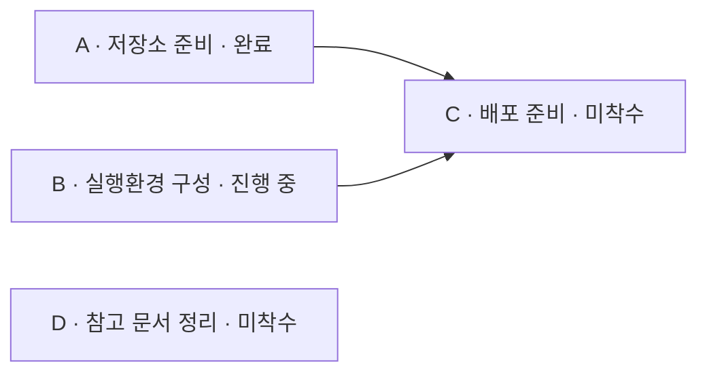

# Tevro — 해결하려는 문제와 제품 요구사항

- 문서 상태: 요구사항 초안. 구현 완료를 의미하지 않음.
- 작성 기준일: 2026-09-26
- 서비스명: Tevro / 테브로
- 제공 형태: 폐쇄망에 설치하여 사용하는 서버 + 웹 애플리케이션, 동일 서버에 접근하는 CLI
- 문서 목적: 해결하려는 업무상 문제, 사용자에게 제공할 기능, 제품의 경계와 검증 기준을 공유한다.

> Tevro는 프로젝트에 필요한 공정을 직접 만들고 연결하여, 해야 할 일과 선후관계, 진행 상태를 한눈에 확인하는 도구다. 반복되는 공정은 템플릿으로 재사용하고, 필요한 경우 Jira 이슈와 연동한다. 사용자는 웹 GUI 또는 CLI를 통해 같은 정보를 관리할 수 있다.

## 1. 제품의 출발점

프로젝트에는 프로그램 개발뿐 아니라 저장소 준비, CI 구성, GitOps 설정, 실행환경 준비, 데이터베이스 작업, 검증, 배포 등 여러 공정이 포함된다. 각 공정 중에는 독립적으로 진행할 수 있는 것도 있고, 여러 선행 공정이 준비되어야 진행할 수 있는 것도 있다.

사용자에게 필요한 것은 단순한 이슈 목록이나 일정표가 아니라 다음 질문에 답하는 화면이다.

1. 이번 프로젝트에서 해야 하는 일은 무엇인가?
2. 특정 공정을 진행하려면 어떤 선행 공정이 필요한가?
3. 어떤 공정이 완료됐고, 무엇이 진행 중이거나 아직 시작되지 않았는가?
4. 현재 선행 조건이 갖춰진 공정과 아직 준비되지 않은 공정은 무엇인가?
5. 반복되는 프로젝트에서 이전에 정의한 업무와 관계를 다시 입력하지 않고 사용할 수 있는가?
6. 이 정보를 GUI에서 직접 편집하고, AI 에이전트도 CLI로 조회·수정할 수 있는가?
7. Jira를 사용하는 경우, 같은 일을 두 번 등록하거나 진행 상태를 중복 관리하지 않을 수 있는가?

적용 대상은 차세대 시스템 구축에 한정하지 않는다. 신규 서비스 준비, 시스템 이전, 업무 변경, 운영 이관 등 여러 공정과 선후관계를 가진 프로젝트에 공통으로 사용할 수 있어야 한다.

## 2. 해결하려는 업무상 문제

| ID | 현재의 문제 | 구체적인 비효율 또는 위험 |
| --- | --- | --- |
| P-01 | 전체 작업 범위가 이슈와 문서에 분산됨 | 담당자가 여러 목록과 문서를 비교해야 전체 공정을 파악할 수 있고, 등록된 업무 중 미착수·미완료 항목을 놓치기 쉬움 |
| P-02 | 공정 간 선후관계를 개별적으로 확인해야 함 | C를 수행하려면 A와 B가 모두 필요하더라도, 각 이슈를 열거나 담당자에게 문의해야 준비 여부를 알 수 있음 |
| P-03 | 선후관계와 실행 상태를 따로 봐야 함 | A 완료, B 진행 중, C 미착수라는 정보가 있어도 이들이 연결된 이유와 C에 남아 있는 선행 조건을 즉시 이해하기 어려움 |
| P-04 | 독립 공정이 관계 중심 화면에서 빠질 수 있음 | 연결선이 없는 업무가 표시되지 않으면, 전체 작업 범위를 확인하려는 목적을 달성할 수 없음 |
| P-05 | 유사 프로젝트마다 업무와 관계를 다시 작성함 | 표준화된 공정이 있어도 제목·설명·선후관계를 반복 입력하며, 복사 과정에서 항목이나 관계가 누락될 수 있음 |
| P-06 | 작업 절차와 참고 문서 탐색이 반복됨 | 공정 설명, Confluence의 작업 절차, Jira 이슈, 기한 등을 확인하기 위해 여러 화면을 오가야 함 |
| P-07 | 시각 자료와 실제 관리 정보가 분리됨 | 별도로 그린 그림이나 문서가 최신 이슈 상태와 달라져, 그림을 다시 수정하거나 정보를 대조해야 함 |
| P-08 | Jira와 별도 도구의 이중 입력이 발생함 | 설계한 공정을 Jira에 다시 입력하고, 종속성 링크까지 다시 설정하며, 두 시스템의 상태를 각각 확인해야 함 |
| P-09 | GUI 중심의 반복 입력을 자동화하기 어려움 | 여러 공정을 일괄 등록·수정하거나 연결 관계를 검사할 때, AI 에이전트나 스크립트가 사용할 일관된 명령 인터페이스가 필요함 |
| P-10 | 담당 범위와 남은 일정의 파악에 추가 정리가 필요함 | 우리 팀 업무인지 외부 요청이 필요한지, 담당자와 예상 소요 시간은 무엇인지, 어떤 미완료 작업의 기한이 가까운지 별도 목록으로 정리해야 함 |

### 누락 방지의 한계

Tevro는 등록된 공정과 표준 템플릿을 바탕으로 누락 가능성을 줄인다. 처음부터 템플릿이나 프로젝트에 등록되지 않은 업무의 존재를 자동으로 알아내는 제품은 아니다. 표준 공정의 완전성과 최신성은 사람이 검토해야 한다.

## 3. 목표와 기본 원칙

### 3.1 목표

- 전체 공정, 종속성, 실행 상태를 하나의 화면에서 이해할 수 있게 한다.
- 공정과 연결 관계를 GUI에서 직접 생성·편집할 수 있게 한다.
- 표준 공정을 템플릿으로 정의하고 프로젝트마다 독립적으로 재사용한다.
- Jira 사용 여부와 무관하게 기본 기능을 사용할 수 있게 한다.
- 필요한 경우 공정과 관계를 Jira 이슈 및 링크로 생성하고, Jira의 상태를 가져온다.
- 모든 사용자 데이터 조작 기능을 CLI로도 제공하여 AI 에이전트가 작업할 수 있게 한다.
- 외부 인터넷 연결 없이 사내 서버와 브라우저만으로 운영할 수 있게 한다.

### 3.2 제품 원칙

1. **그래프는 장식이 아니라 업무 정보의 표현이다.** 노드는 실제 공정이며, 연결선은 실제 선행관계다.
2. **독립 공정도 전체 공정이다.** 연결되지 않은 공정을 숨기지 않는다.
3. **선행 조건과 실행 상태를 구분한다.** 선행 작업이 미완료여도 사용자가 후속 작업을 진행할 수 있다. 미충족 조건은 표시하되 착수나 상태 변경을 강제로 차단하지 않는다.
4. **Jira는 선택적 연동이다.** Jira 설정이나 계정이 없어도 공정 작성·상태 관리·템플릿 재사용이 가능해야 한다.
5. **Confluence, Jira, 데드라인은 필수 입력이 아니다.** 필요한 프로젝트와 공정에만 설정한다.
6. **템플릿과 실제 프로젝트는 독립적이다.** 한 프로젝트를 수정했다고 템플릿이나 다른 프로젝트가 바뀌면 안 된다.
7. **GUI와 CLI의 기능 및 검증 규칙은 같아야 한다.** CLI를 우회 입력 수단이나 별도의 데이터 저장소로 만들지 않는다.
8. **알 수 없는 상태를 완료나 미완료로 단정하지 않는다.** 특히 Jira 조회 실패와 매핑되지 않은 상태는 확인 필요로 구분한다.
9. **자동화보다 가시성을 먼저 제공한다.** 승인·강제 진행 제어·업무 자동 실행 엔진으로 범위를 넓히지 않는다.
10. **구현 범위와 사용 시 선택 여부를 구분한다.** 선택 기능도 제품 요구사항에 포함되지만, 사용자가 설정하지 않았다고 기본 기능이 제한되면 안 된다.

## 4. 주요 사용자와 사용 흐름

### 4.1 주요 사용자

| 사용자 | 필요한 일 |
| --- | --- |
| 프로젝트 담당자 | 전체 공정과 선후관계를 정의하고, 누락·진행 현황을 확인 |
| 개별 공정 수행자 | 본인 공정의 내용, 선행 조건, 관련 문서, 상태와 기한을 확인·수정 |
| 표준 공정 관리 담당자 | 반복되는 공정을 템플릿으로 정리하고 유지 |
| AI 에이전트 또는 자동화 스크립트 | 사용자가 허용한 범위에서 CLI로 공정과 관계를 조회·편집 |

이 구분은 사용 목적을 설명하는 것이며, 그대로 권한 역할을 확정한 것은 아니다.

### 4.2 대표 흐름

- **새 프로젝트 작성:** 프로젝트 생성 → GUI 또는 CLI로 공정 추가 → 선후관계 연결 → 상태 확인·수정.
- **반복 업무 재사용:** 템플릿 선택 → 새 프로젝트 생성 → 이번 프로젝트에 맞게 공정과 관계 수정 → 독립적으로 진행.
- **준비 상태 점검:** 공정 C 선택 → 선행 공정 A·B 확인 → A 완료, B 진행 중 확인 → C에 필요한 준비 사항 판단.
- **Jira 게시:** 대상 Jira 프로젝트·이슈 유형 선택 → 생성할 공정과 관계 미리 보기 → 이슈 생성 → 새 이슈끼리 링크 생성 → 매핑 저장.
- **Jira 현황 확인:** 연결된 이슈 상태 조회 → 그래프 표시 갱신 → 조회 실패나 불일치 별도 표시.
- **에이전트 작업:** CLI로 프로젝트 조회 → 공정과 관계 변경 → 서버 검증 → GUI에서 같은 결과 확인.

## 5. 핵심 개념과 관계 의미

| 개념 | 정의 |
| --- | --- |
| 프로젝트 | 실제로 진행하는 한 번의 업무 집합. 공정·종속성·상태를 포함함 |
| 공정 / Task | 수행할 하나의 업무 단위. 화면의 노드와 대응하며 Jira 이슈와는 별개로 존재할 수 있음 |
| 종속성 / Dependency | 한 공정이 다른 공정의 선행 조건이라는 방향 있는 관계 |
| 템플릿 | 반복 사용할 공정 정의와 종속성의 묶음. 실제 실행 상태와 분리됨 |
| 템플릿 적용 | 템플릿을 복제하여 독립적인 프로젝트와 공정들을 생성하는 작업 |
| Jira 매핑 | Tevro 공정과 특정 Jira 사이트의 특정 이슈 사이의 연결 정보 |
| 실행 상태 | 공정 자체의 미착수·진행 중·완료 여부 |
| 선행 조건 충족 여부 | 선행 공정들의 상태를 바탕으로 계산한 준비 정보. 실행 상태와 별도임 |

### 5.1 연결 방향

`A → C`는 **A가 C의 선행 공정**이라는 뜻이다. 초기 관계 모델은 선행 공정의 완료를 기준으로 판단한다. 단순 참고 관계, 시작-시작 관계, 시차 조건 등 여러 일정 관계를 함께 도입하지 않는다.

A와 B가 모두 C에 연결되면 C의 선행 조건은 A와 B의 완료를 모두 요구한다. 둘 중 하나만 완료하면 되는 OR 조건은 초기 모델에 포함하지 않는다.



위 예시에서 D도 반드시 화면에 표시한다. C는 선행 공정 B가 미완료임을 보여주되, 사용자가 C를 진행 중으로 바꾸는 행위를 차단하지 않는다.

### 5.2 DAG와 병행 가능성

자기 자신을 향하는 연결, 중복 연결, 순환을 만드는 연결은 허용하지 않는다. 공정들은 여러 개의 분리된 그래프를 이룰 수 있고, 시작점이나 종료점이 하나일 필요도 없다.

두 공정 사이에 선후 경로가 없으면 종속성상 병행할 수 있는 후보로 볼 수 있다. 다만 담당자나 자원 부족 등 그래프에 없는 제약까지 없다는 의미는 아니다. 단계나 분류가 같다는 이유로 의존성을 자동 생성하지 않는다.

## 6. 전체 사용자 기능

아래 기능은 전체 제품 범위다. 초기 구현 대상, 선택적 사용 기능, 이후 확장 대상은 11장에서 별도로 구분한다. 기능 ID는 논의와 구현·검증을 연결하기 위한 식별자다.

### 6.1 프로젝트와 공정 관리

| ID | 기능 | 사용자 관점의 요구사항 |
| --- | --- | --- |
| F-P01 | 프로젝트 생성·조회 | 프로젝트 이름과 선택적 설명을 등록하고, 목록에서 해당 프로젝트를 열 수 있음 |
| F-P02 | 프로젝트 정보 수정 | 프로젝트 이름과 설명을 수정할 수 있음 |
| F-P03 | 공정 생성 | GUI에서 노드를 추가하거나 CLI로 공정을 등록할 수 있음. 제목 이외의 부가 정보는 필요한 범위에서만 입력 |
| F-P04 | 공정 내용 편집 | 제목과 상세 설명을 편집할 수 있고, 여러 줄의 작업 절차·완료 기준 등을 설명에 기록할 수 있음 |
| F-P05 | 요약·상세 보기 | 그래프에서는 핵심 정보를 간략히 보고, 공정을 선택하면 전체 설명과 부가 정보를 확인할 수 있음 |
| F-P06 | 공정 삭제 | 공정 삭제 시 관련 연결과 Jira 매핑에 미치는 영향을 확인할 수 있음. Tevro에서 삭제했다고 실제 Jira 이슈를 자동 삭제하지 않음 |
| F-P07 | 공정 조회 | 제목 또는 식별자로 공정을 찾고, 프로젝트 안의 공정 목록을 조회할 수 있음 |
| F-P08 | 지속적 저장 | 공정과 관계·상태를 저장하고, 브라우저나 서버를 다시 열어도 동일한 프로젝트를 이어서 관리할 수 있음 |

별도 체크리스트 필드, 댓글 시스템, 첨부파일 관리까지 초기 제품에 포함하지 않는다. 상세 작업 절차는 우선 공정 설명과 Confluence 링크로 제공한다.

### 6.2 종속성 생성·편집

| ID | 기능 | 사용자 관점의 요구사항 |
| --- | --- | --- |
| F-D01 | GUI 연결 생성 | 공정 A와 B를 연결하여 A가 B의 선행 공정임을 설정할 수 있음 |
| F-D02 | 연결 변경·삭제 | 잘못된 연결을 삭제하거나 방향·연결 대상을 수정할 수 있음 |
| F-D03 | 다중 선행·후속 | 한 공정에 여러 선행 공정과 여러 후속 공정을 연결할 수 있음 |
| F-D04 | 구조 검증 | 자기 참조, 중복 연결, 존재하지 않는 공정 참조, 순환 종속성을 거부하고 이유를 알려줌 |
| F-D05 | 선행·후속 조회 | 특정 공정의 직접 선행·후속 공정을 확인하고, 전체 경로를 따라 영향 범위를 파악할 수 있음 |
| F-D06 | 동일한 서버 검증 | GUI, CLI, 템플릿 적용 등 어떤 입력 경로에서도 동일한 DAG 검증을 수행함 |

초기 종속성은 같은 프로젝트 안의 공정 사이에 정의한다. 프로젝트를 가로지르는 연결은 이후 검토 대상으로 둔다.

### 6.3 DAG 시각화

| ID | 기능 | 사용자 관점의 요구사항 |
| --- | --- | --- |
| F-G01 | 전체 공정 표시 | 연결된 공정뿐 아니라 독립 공정과 완료된 공정도 기본 화면에 표시 |
| F-G02 | 방향 구분 | 선행에서 후속으로 향하는 방향을 화살표 등으로 명확하게 표시 |
| F-G03 | 상태 표시 | 각 노드에서 실행 상태를 바로 확인. 색만이 아니라 텍스트나 아이콘도 함께 사용 |
| F-G04 | 탐색 | 화면 이동·확대·축소·전체 보기로 그래프를 탐색할 수 있음 |
| F-G05 | 기본 배치 | 공정 간 관계를 읽을 수 있는 초기 배치와 다시 정렬하는 기능 제공. 구체적인 배치 알고리즘은 미정 |
| F-G06 | 선택 공정 강조 | 선택한 공정과 관련 선행·후속 관계를 식별하고 상세 정보로 이동 |
| F-G07 | 선택 정보 표시 | 설정된 경우에만 데드라인, Jira 키, 문서 링크 등의 요약 정보를 표시 |

Mermaid와 유사한 방향성 그래프를 원하는 것이며, Mermaid 문법 편집을 사용 전제로 삼지 않는다. GUI 편집을 위해 Mermaid를 반드시 구현 기술로 사용할 필요도 없다. Mermaid 내보내기는 후속 편의 기능 후보이지 초기 필수 기능은 아니다.

### 6.4 실행 상태와 선행 조건

| ID | 기능 | 사용자 관점의 요구사항 |
| --- | --- | --- |
| F-S01 | 기본 실행 상태 | 미착수, 진행 중, 완료 상태를 제공 |
| F-S02 | 수동 상태 변경 | Jira가 상태 원본이 아닌 공정의 상태를 GUI와 CLI에서 변경하고, 필요하면 완료 상태도 되돌릴 수 있음 |
| F-S03 | 선행 조건 표시 | 각 공정의 선행 조건 충족 여부와 미완료 선행 공정 목록을 확인할 수 있음 |
| F-S04 | 비강제 진행 | 선행 공정이 미완료여도 후속 공정을 착수·완료할 수 있음. 모순 가능성은 알리되 상태를 강제로 바꾸지 않음 |
| F-S05 | 상태 요약 | 전체 공정 수와 상태별 수를 확인하고, 남은 공정을 조회할 수 있음. 단순 개수 비율을 실제 노력 기반 진척률로 표현하지 않음 |
| F-S06 | 확인 필요 구분 | 외부 상태를 확인할 수 없거나 매핑이 없을 때, 정상 조회한 실행 상태와 구분 |

상태와 준비 정보는 예를 들어 다음처럼 동시에 표현할 수 있다.

```text
공정 C
  실행 상태: 진행 중
  선행 조건: 미충족
  미완료 선행 공정: B
```

선행 공정이 없는 경우 선행 조건은 충족된 것으로 보되, 업무의 실행 가능성을 완전히 보장하는 판정으로 표현하지 않는다. 확인할 수 없는 선행 상태가 있으면 충족으로 단정하지 않는다.

### 6.5 선택 정보: Confluence, 데드라인 및 기타 업무 정보

| ID | 기능 | 사용자 관점의 요구사항 |
| --- | --- | --- |
| F-M01 | Confluence 링크 | 공정에 관련 페이지 URL을 선택적으로 등록·수정·제거하고, GUI에서 해당 페이지를 열 수 있음 |
| F-M02 | 독립적인 링크 사용 | Confluence API 연동, 내용 수집, 별도 인증을 요구하지 않고 링크만으로 사용 가능. 페이지 열람 권한은 Confluence에서 관리 |
| F-M03 | 데드라인 | 공정별 완료 기한을 선택적으로 등록·수정·제거하고 표시 |
| F-M04 | 기한 확인 | 기한이 지난 미완료 공정을 식별하고, 미완료 공정을 데드라인순으로 조회. 기한이 없는 공정도 누락 없이 별도 구분 |
| F-M05 | 담당팀·담당자 | 이전 업무관리 요구의 확장 항목. 공정의 담당팀과 담당자를 기록·표시 |
| F-M06 | 내부·외부 업무 구분 | 이전 업무관리 요구의 확장 항목. 우리 팀 수행인지 다른 팀·외부에 요청해야 하는 일인지 기록 |
| F-M07 | 예상 소요 시간 | 이전 업무관리 요구의 확장 항목. 이미 알려진 예상 소요 시간 또는 리드타임을 단위와 함께 기록 |
| F-M08 | 수행 기록과 절차 | 설명·문서 링크로 방법과 완료 기준을 제공. 별도 수행 기록 필드와 체계적인 변경 이력은 이후 확장 여부 검토 |

F-M05~F-M08은 초기 최소 기능을 늘리기 위한 필수 항목이 아니라, 이전에 제기된 업무상 요구를 빠뜨리지 않기 위해 별도로 보존한다. 데드라인의 날짜·시각 정밀도와 시간대 규칙은 구현 전 확정한다.

### 6.6 템플릿 정의와 재사용

| ID | 기능 | 사용자 관점의 요구사항 |
| --- | --- | --- |
| F-T01 | 템플릿 작성 | 이름·설명과 함께 공정 및 종속성을 GUI와 CLI로 정의 |
| F-T02 | 프로젝트에서 추출 | 기존 프로젝트의 공정 정의와 관계를 템플릿으로 저장 |
| F-T03 | 템플릿 편집 | 공정 내용·연결을 수정하며, 프로젝트와 동일한 DAG 검증 적용 |
| F-T04 | 새 프로젝트 생성 | 템플릿을 선택하여 새 프로젝트의 공정과 관계를 함께 생성 |
| F-T05 | 독립적인 식별자 | 새 공정에는 새로운 식별자를 부여하고, 종속성도 새로 생성한 공정끼리 연결 |
| F-T06 | 실행 정보 초기화 | 완료·진행 상태, 실제 Jira 이슈 매핑, 동기화 결과 등 이전 실행 정보를 가져오지 않음 |
| F-T07 | 프로젝트별 수정 | 적용 후 공정 추가·내용 수정·관계 변경·불필요한 공정 제외가 가능하며 원본과 다른 프로젝트에는 영향 없음 |
| F-T08 | 템플릿 변경의 격리 | 템플릿 수정이 진행 중인 프로젝트를 자동 변경하지 않음 |
| F-T09 | 출처 확인 | 어떤 템플릿 정의로 프로젝트를 만들었는지 확인할 수 있도록 출처와 적용 당시 정의를 식별할 정보 보존 |
| F-T10 | 목록·조회·관리 | 저장된 템플릿을 조회·선택하고 수정·삭제할 수 있음. 템플릿 삭제가 이미 생성된 프로젝트를 삭제하지 않음 |

#### 복제 규칙

- 복제 대상: 공정 제목, 설명, 종속성, 재사용 가능한 참고 문서 링크.
- 초기화 대상: 공정 실행 상태, Jira 이슈 키·ID와 매핑, 동기화 시간·오류, 이전 실행 결과.
- 데드라인: 과거 프로젝트의 절대 날짜를 무조건 복제하지 않는다. 초기에는 비워 두고 프로젝트별로 설정하는 방식을 제안한다.
- 담당자·예상 소요 시간: 해당 확장 기능을 도입할 때 복제 여부를 명시적으로 정한다.
- 시작일 기준 상대 기한, 여러 템플릿 합성, 템플릿 변경을 기존 프로젝트에 선택적으로 병합하는 기능은 초기 범위에 포함하지 않는다.
- 제외 공정을 단순 삭제하는 대신 ‘해당 없음 + 사유’로 남기는 방식은 누락과 의도적 제외를 구분하기 위한 후속 설계 후보다. 기본 실행 상태에 확정 추가한 것은 아니다.

### 6.7 Jira 선택 연동

#### 기존 이슈 연결 및 신규 생성

| ID | 기능 | 사용자 관점의 요구사항 |
| --- | --- | --- |
| F-J01 | 연동 설정 | 사내 Jira 주소와 인증 정보를 설정하고 연결·권한을 확인. 설정하지 않아도 기본 기능 사용 가능 |
| F-J02 | 기존 이슈 연결 | 공정에 기존 Jira 이슈의 키 또는 URL을 지정하여 연결 |
| F-J03 | 이슈 정보 표시 | 연결된 이슈의 키·제목·상태를 확인하고 Jira 화면으로 이동 |
| F-J04 | 연결 해제 | Tevro의 매핑만 해제할 수 있음. 실제 Jira 이슈나 다른 사용자의 링크를 자동 삭제하지 않음 |
| F-J05 | 공정 하나를 이슈로 생성 | 공정 제목·내용을 바탕으로 선택한 기존 Jira 프로젝트에 새 이슈를 생성하고 매핑 저장 |
| F-J06 | 여러 공정을 이슈로 생성 | 선택한 공정 또는 전체 미연결 공정을 일괄 생성. 독립 공정도 생성 대상에 포함 |
| F-J07 | 생성 항목 확인 | 대상 프로젝트, 이슈 유형, 필수 필드, 생성 대상과 이미 연결된 항목을 실행 전에 확인 |
| F-J08 | 종속성 링크 생성 | 공정 간 방향 있는 종속성을 생성된 Jira 이슈 또는 이미 매핑된 이슈 사이의 링크로 반영 |
| F-J09 | 개별 결과 확인 | 공정별 이슈 생성 결과와 관계별 링크 생성 결과를 구분하여 표시 |

이 기능은 **기존 Jira 프로젝트 안에 이슈를 생성하는 기능**이다. Jira 프로젝트 자체를 새로 만드는 관리 기능과 구분한다. 기존 이슈 전체를 JQL로 가져와 Tevro 프로젝트를 구성하는 기능은 별도 확장 대상으로 둔다.

#### 링크 의미와 재시도

- Tevro의 `A → B`는 Jira에서도 ‘A가 B의 선행 조건’이라는 의미를 유지해야 한다. 표시 이름만이 아니라 실제 링크 방향을 검증한다.
- 사용할 Jira 링크 유형은 사이트 설정에 맞게 선택·매핑한다. 특정 영문 이름이 모든 사이트에 존재한다고 가정하지 않는다.
- 양쪽 공정의 Jira 매핑이 확보된 이후에 링크를 생성한다. 한쪽 생성에 실패했다면 해당 관계를 완료로 표시하지 않는다.
- 이미 Jira에 연결된 공정에는 새 이슈를 중복 생성하지 않는다.
- 성공한 이슈·링크와 실패한 항목을 저장하여, 재시도 시 성공한 작업을 무조건 반복하지 않는다.
- 요청 시간 초과 등으로 Jira에는 생성됐지만 응답을 받지 못한 경우를 별도로 다룬다. 결과 미확인 상태를 표시하고 중복 생성 전에 확인·복구할 수 있어야 한다.
- 여러 이슈와 링크 생성 전체가 하나의 원자적 작업이라고 가정하지 않는다. 부분 성공 상태를 사용자에게 정확하게 알린다.
- Tevro에서 연결을 제거했다고 Jira의 해당 링크를 자동 삭제하지 않는다. 이후 삭제 동기화를 지원한다면 Tevro가 관리하는 관계와 사용자가 직접 만든 관계를 구분하고 영향을 먼저 보여준다.

#### Jira 상태 조회

| ID | 기능 | 사용자 관점의 요구사항 |
| --- | --- | --- |
| F-J10 | 상태 새로고침 | 개별 공정 또는 프로젝트의 연결된 Jira 이슈 상태를 수동으로 조회·갱신 |
| F-J11 | 그래프 반영 | Jira의 실행 상태를 Tevro의 노드에 반영하여 완료·진행 중·미착수 여부를 파악 |
| F-J12 | 상태 매핑 | Jira의 실제 상태명과 기본 상태 구분을 함께 다루며, 인식하지 못한 상태는 확인 필요로 표시 |
| F-J13 | 조회 정보 표시 | 마지막 정상 조회 시각, 최신 조회 성공 여부, 인증·권한·접속 오류를 구분하여 표시 |
| F-J14 | 일부 실패 처리 | 일부 이슈 조회가 실패해도 나머지 조회 결과를 보존하고, 실패한 공정을 완료나 삭제로 오해하지 않게 표시 |

#### 정보의 원본 원칙

초기 연동의 혼란을 줄이기 위한 설계 제안은 다음과 같다.

| 정보 | 원본 또는 처리 원칙 |
| --- | --- |
| 표준 공정과 템플릿 | Tevro에서 관리 |
| 프로젝트의 공정 정의와 관계 | Tevro에서 관리하고, Jira 반영은 명시적인 생성·연결 작업으로 수행 |
| Jira 미연결 공정의 실행 상태 | Tevro에서 직접 수정 |
| Jira 상태 연동을 사용하는 공정의 실행 상태 | Jira에서 읽어 표시. Tevro에서 별도 수동 값을 덮어써 서로 다른 상태를 만들지 않음 |
| Jira 생성 이후의 제목·설명 | 양방향 자동 동기화는 초기 범위에서 제외. Tevro 수정이 Jira에 반영되지 않는다는 점을 화면에 알림 |
| Jira에서 외부 변경된 종속성 | 자동으로 Tevro 정의를 덮어쓰지 않음. 읽기·차이 확인·충돌 해소 정책은 확장 설계에서 결정 |

Jira 상태를 Tevro에서 직접 변경하는 기능, 주기적 자동 조회, 웹훅 수신, 전 필드 양방향 동기화는 후속 검토 대상이다. 상태 조회 기능의 존재를 실시간 동기화 보장으로 표현하지 않는다.

### 6.8 CLI와 AI 에이전트 지원

| ID | 기능 | 사용자 관점의 요구사항 |
| --- | --- | --- |
| F-C01 | 기능 동등성 | 프로젝트·공정·관계·상태·선택 정보·템플릿·Jira 기능을 CLI에서도 제공 |
| F-C02 | 구조화 조회 | 공정, 연결 목록, 선행 조건, 동기화 결과를 AI 에이전트가 해석할 수 있는 구조화된 형식으로 조회 |
| F-C03 | 비대화형 실행 | 대화형 프롬프트 없이 필요한 인자를 명시하여 실행할 수 있고, 입력 누락은 예측 가능한 오류로 응답 |
| F-C04 | 일관된 식별자 | GUI에 표시된 공정과 CLI 명령이 같은 식별자를 사용 |
| F-C05 | 실패 식별 | 검증 실패, 권한 부족, 동시 수정 충돌, 외부 연동 실패 등을 구분하고 적절한 종료 코드를 제공 |
| F-C06 | 조회와 변경 구분 | 조회 명령이 데이터를 바꾸지 않으며, 변경 명령의 대상과 영향을 명확하게 지정 |
| F-C07 | 대량·외부 변경 확인 | Jira 일괄 생성 등 영향이 큰 작업은 실행 대상 미리 보기 또는 dry-run을 제공. 실제 변경 시 명시적인 실행 의사 필요 |
| F-C08 | 서버 공유 | CLI가 GUI와 동일한 서버에 요청하고, 별도 파일이나 DB에 독립 상태를 만들지 않음 |
| F-C09 | 비밀정보 보호 | 인증 정보를 출력·오류·일반 프로젝트 데이터에 노출하지 않고, 에이전트 작업에 필요한 권한만 사용 |
| F-C10 | 도움말 | 사용 가능한 명령, 필수 인자, 출력 형식, 실패 원인을 도구 자체에서 확인 |

에이전트 사용은 CLI를 통한 외부 작업 방식이다. Tevro 내부에 LLM 서비스, 채팅 UI, 자동 계획 생성 기능을 탑재하는 요구사항은 아니다. 화면 이동·확대 같은 순수 시각 조작을 CLI에 그대로 복제할 필요는 없지만, 그 화면의 공정·관계·상태 데이터는 CLI로 조회할 수 있어야 한다.

#### 명령 체계 예시 — 미확정

아래는 제공해야 할 작업 범위를 보여주는 예시이며, 구현되었거나 최종 CLI 문법이 확정됐다는 뜻은 아니다. 식별자는 해당 조회·생성 결과에서 얻은 값을 사용한다.

```sh
# 프로젝트와 공정
tevro project create --name "신규 서비스 준비"
tevro project list --json
tevro task add --project <project-id> --title "CI 구성"
tevro task update <task-id> --description-file ./procedure.md
tevro task list --project <project-id> --json
tevro task show <task-id> --json
tevro task status <task-id> --set in-progress
tevro task delete <task-id>

# 종속성 및 구조 확인
tevro dependency add --project <project-id> --from <task-a-id> --to <task-c-id>
tevro dependency remove --project <project-id> --from <task-a-id> --to <task-c-id>
tevro graph show --project <project-id> --json
tevro graph validate --project <project-id>

# 선택 정보
tevro task update <task-id> --confluence-url <page-url>
tevro task update <task-id> --deadline <YYYY-MM-DD>

# 템플릿 작성·적용
tevro template create --name "표준 서비스 준비"
tevro template save-from-project --project <project-id> --name "표준 서비스 준비"
tevro template instantiate <template-id> --project-name "서비스 B 준비"

# Jira 연결·생성·조회
tevro jira link <task-id> --issue <jira-issue-key>
tevro jira publish --project <project-id> --dry-run --json
tevro jira publish --project <project-id> --apply --json
tevro jira refresh --project <project-id> --json
```

テンプレート用の専用編集コマンドを設けるか、共通の公程編集コマンドで編集対象を指定するかは未確定。

## 7. 情報・データ設計の境界

### 7.1 概念データ

以下は保存すべき情報の整理であり、DBスキーマやAPI仕様の確定ではない。

| 対象 | 必要な情報 |
| --- | --- |
| プロジェクト | 安定したID、名前、説明、作成・更新情報、適用元テンプレート情報 |
| 公程 | 安定したID、所属プロジェクト、タイトル、説明、実行状態、任意の期限・文書リンク |
| 依存関係 | 所属プロジェクト、先行公程ID、後続公程ID |
| テンプレート | 安定したID、名前、説明、公程定義、内部依存関係、適用時点を識別できる情報 |
| Jiraマッピング | Jiraサイト識別情報、Tevro公程ID、JiraイシューID・キー、状態取得情報 |
| Jira反映結果 | 公程・関係ごとの処理状態、成功結果、失敗・結果未確認の情報 |

### 7.2 設計上の制約

- 공정의 ID는 제목을 바꿔도 유지한다. 제목을 연결 관계의 식별자로 사용하지 않는다.
- 화면상의 노드 위치와 선후관계는 별개다. 노드를 이동했다고 종속성이 바뀌면 안 된다.
- 템플릿의 공정 식별자와 프로젝트 실행본의 공정 식별자를 구분한다.
- 삭제되는 공정을 참조하는 연결이 남지 않도록 일관성을 유지한다.
- 선행 조건 충족 여부는 실행 상태와 관계로 계산하며, 독립된 수동 상태로 관리하지 않는다.
- Jira 인증 정보는 일반 공정·템플릿 데이터와 분리한다. 공개 저장소나 템플릿에 인증값을 넣지 않는다.
- 공동 사용 중 오래된 화면이나 에이전트가 다른 사용자의 변경을 무조건 덮어쓰지 않도록 충돌을 식별한다.

## 8. 서버·웹 배포 및 운영 요구사항

| ID | 요구사항 | 범위 |
| --- | --- | --- |
| N-01 | 폐쇄망 설치 | 사내 서버에 설치하고 내부 브라우저에서 접근할 수 있어야 함 |
| N-02 | 외부 인터넷 비의존 | 실행 시 외부 SaaS, CDN, 외부 글꼴·스크립트 다운로드, 외부 인증·LLM 연결을 필수로 요구하지 않음 |
| N-03 | 설치 재현성 | 필요한 배포물과 의존성을 반입하여 설치·업데이트할 수 있도록 절차 제공. 배포 포맷과 내부 레지스트리 활용 방식은 미정 |
| N-04 | 데이터 보존 | 서버 재시작 후 데이터가 유지되고, 백업·복구 방법이 있어야 함 |
| N-05 | 선택적 사내 연동 | Jira 연동은 설정된 사내 시스템에만 접근하며, 외부 시스템 장애가 기본 공정 조회·편집까지 막지 않음 |
| N-06 | 접근 및 인증 보호 | 웹과 CLI의 인증·권한 검사 및 서버 측 검증을 일관되게 적용. 구체적인 사내 인증 연동 방식과 권한 모델은 미정 |
| N-07 | 오류의 가시성 | 저장 실패·권한 오류·동시 수정 충돌·Jira 동기화 실패를 성공으로 오인하게 표시하지 않음 |
| N-08 | 사내 네트워크 대응 | 내부 주소와 인증서 등 설치 환경을 고려한 설정 제공. 인증서 검증을 무조건 비활성화하는 방식으로 해결하지 않음 |

개발 언어, 프런트엔드 프레임워크, 그래프 라이브러리, DB, 컨테이너·OpenShift 사용 여부는 이 문서에서 확정하지 않는다. 특정 기술을 채택하기 전에 위 사용자 기능과 폐쇄망 제약을 만족하는지 검토한다.

## 9. 초기 범위에 포함하지 않는 것

- 선행 공정 미완료 시 후속 공정 착수·상태 변경 강제 차단.
- 승인 절차 엔진, BPMN 실행 엔진, CI/CD 작업의 실제 실행.
- Jira 전체 기능의 대체: 스프린트, 백로그, 댓글, 알림, 이슈 권한 관리 등.
- Confluence 문서 편집·내용 수집·검색 시스템.
- 자원 배분, 자동 일정 산출, 간트 기반 계획, 크리티컬 패스 최적화.
- 여러 종류의 일정 종속성, OR 분기, 반복 실행 루프. 현재 관계는 완료 기준의 AND 선행 조건을 표현하는 DAG.
- 모든 Jira 필드와 관계의 무조건적인 양방향 실시간 동기화.
- Jira 이슈 또는 Jira 프로젝트의 자동 삭제.
- 템플릿에 없는 업무를 AI가 자동 발굴한다는 보장.
- 내장 AI 모델, 에이전트 실행 환경, 별도 MCP 서버.
- 대규모 조직 관리·복잡한 역할 체계·실시간 공동 커서 등 협업 고도화.

이 항목들은 제품의 영구적인 금지가 아니라, 현재 문제를 해결하기 위해 초기부터 떠안을 필요가 없는 범위다. 특히 업무 강제 차단은 현재 사용 목적에 부합하지 않는다.

## 10. 사용자 관점의 검증 기준

| ID | 상황 | 기대 결과 |
| --- | --- | --- |
| AC-01 | A와 B를 C의 선행으로 연결하고 독립 공정 D를 등록 | A·B·C·D가 모두 표시되고 연결 방향이 정확함 |
| AC-02 | A는 완료, B는 진행 중, C는 미착수 | 각 상태와 C의 미완료 선행 공정 B를 한 화면에서 파악 가능 |
| AC-03 | AC-02에서 C를 진행 중으로 변경 | 변경은 허용되고 B 미완료 정보도 유지됨 |
| AC-04 | A → B가 있을 때 B → A를 추가 | 순환을 만드는 관계가 거부되고 기존 데이터는 유지됨. CLI에서도 동일 |
| AC-05 | 공정 이름을 바꾸거나 노드를 이동 | 공정의 ID와 기존 선후관계가 유지됨 |
| AC-06 | 선택 정보를 하나도 입력하지 않음 | 공정 생성·그래프 편집·상태 관리·템플릿 사용이 가능 |
| AC-07 | 같은 템플릿으로 프로젝트 X·Y를 생성 | 각각 독립된 공정과 내부 연결이 생기고 실행 상태·Jira 매핑은 초기화됨 |
| AC-08 | X나 원본 템플릿의 내용·관계를 수정 | Y의 내용과 진행 상태가 자동 변경되지 않음 |
| AC-09 | 여러 공정과 관계를 Jira에 생성 | 생성된 이슈 키가 저장되고, 새 이슈끼리 올바른 방향으로 연결됨. 독립 공정도 생성됨 |
| AC-10 | Jira 생성이 일부 성공하거나 응답이 끊김 | 성공·실패·결과 미확인을 구분하고, 재시도 전에 중복 가능성을 확인할 수 있음 |
| AC-11 | Jira에서 연결 이슈를 완료로 변경한 후 새로고침 | 그래프에 상태가 반영되고 조회 시각을 확인 가능 |
| AC-12 | 일부 Jira 이슈의 접근 권한이 없거나 연결이 끊김 | 해당 조회 오류를 표시하고, 마지막 확인 상태와 최신 정보 여부를 구분. 나머지 공정은 사용 가능 |
| AC-13 | CLI로 공정·관계·상태를 변경 | GUI를 갱신하면 동일 데이터가 표시되고, 반대 방향도 일치 |
| AC-14 | 외부 인터넷 연결을 차단한 상태에서 서버·웹·CLI 사용 | 기본 기능이 동작하고, 선택 연동은 설정된 사내 시스템에 대해서만 동작 |
| AC-15 | 데드라인이 지난 미완료 공정과 기한 없는 공정을 조회 | 지연 항목을 식별하되 기한 없는 공정을 누락하거나 임의 기한을 부여하지 않음 |

## 11. 구현 범위 구분 및 순서 제안

아래는 사용자 요구를 잃지 않으면서 작게 시작하기 위한 구현 순서 제안이며, 확정된 일정이나 출시 약속이 아니다.

| 구분 | 포함 기능 | 위치 |
| --- | --- | --- |
| 초기 핵심 | 서버·웹, 프로젝트와 공정 생성·편집, DAG 연결·검증·표시, 독립 공정, 실행 상태·선행 조건 표시, 저장, 대응 CLI | 최소한의 제품 가치를 검증 |
| 가벼운 선택 정보 | Confluence 링크, 데드라인 설정·표시·조회, 대응 CLI | 사용하지 않아도 기본 기능 유지 |
| 재사용 | 템플릿 작성·저장·편집·적용, 실행본 분리와 초기화, 대응 CLI | 이번 문서에 명시적으로 포함한 전체 제품 기능 |
| Jira 선택 연동 | 기존 이슈 연결, 신규·일괄 이슈 생성, 종속성 링크 생성, 상태 조회, 부분 실패·중복 방지, 대응 CLI | 이번 문서에 명시적으로 포함한 전체 제품 기능 |
| 이후 업무 정보 확장 | 담당팀·담당자, 내부·외부 업무 구분, 예상 소요 시간, 체계적인 수행 기록 | 이전 요구를 보존하되 초기 최소 기능과 분리 |
| 추가 검토 | 상대 기한, 해당 없음과 제외 사유, 템플릿 합성·버전 병합, Jira 자동 조회·양방향 수정, Mermaid 내보내기 등 | 설계 제안이며 구현 확정 아님 |

각 단계에 포함한 기능은 GUI만 먼저 영구 제공하고 CLI를 무기한 미루지 않는다. 해당 데이터 기능의 CLI 제공까지 그 단계의 완료 범위로 본다.

## 12. 기대 효과와 측정 방법

효과는 도입 후 측정한다. 아직 확인되지 않은 절감 시간·정확도 개선 수치를 성과로 기재하지 않는다.

| 기대 효과 | 확인 방법 |
| --- | --- |
| 공정·진행 현황 확인 시간 감소 | 동일 범위 프로젝트에서 전체 현황과 특정 공정의 선행 조건 확인에 걸리는 시간 비교 |
| 반복 등록 시간 감소 | 같은 공정 집합을 직접 작성하는 경우와 템플릿 적용 후 수정하는 경우 비교 |
| 관계 누락과 방향 오류 감소 | 표준 공정 목록·관계와 실제 프로젝트를 비교하고, 검토 중 발견한 누락·오류 기록 |
| Jira 이중 입력 감소 | 공정 수·관계 수가 같은 프로젝트에서 수동 생성과 Tevro 게시에 드는 작업량 비교 |
| 인수인계와 협업 개선 | 다른 담당자가 해야 할 일·남은 선행 공정·진행 상태를 별도 설명 없이 파악할 수 있는지 확인 |
| 에이전트 활용 기반 확보 | 대표 업무를 GUI 조작 없이 CLI로 재현하고, 결과 일치·오류 처리 여부 확인 |

## 13. 구현 전 추가 결정이 필요한 사항

1. 서버·웹·CLI 기술 구성과 배포·업데이트 방식.
2. 저장 방식, 백업·복구 및 동시 수정 충돌 처리 방식.
3. 사용자 인증과 최소 권한 모델. 공개 열람·수정 범위를 임의로 가정하지 않는다.
4. 상세 설명의 형식과 그래프 배치·위치 저장 규칙.
5. 데드라인의 날짜·시각 정밀도, 시간대, 지연 판정 기준.
6. 실제 사내 Jira의 버전·설정·인증·권한·필수 필드와 링크 유형. 구체적인 API 계약은 해당 환경에서 확인한다.
7. Jira 매핑의 중복 허용 범위, 생성 결과 미확인 시 복구 방법, 연결 해제 후 상태 처리.
8. Jira 상태 매핑, 실제 상태명 표시 방식과 향후 갱신 주기.
9. 템플릿 출처·적용 시점의 식별 및 수정 이력 보존 방식.
10. CLI 최종 명령 체계, 구조화 출력 스키마, 종료 코드와 안전한 인증값 전달 방식.
11. 이후 추가 기능의 우선순위. 본 문서의 설계 제안을 이미 확정된 요구로 혼동하지 않는다.

---

## 최종 제품 정의

**Tevro는 공정의 존재·종속성·진행 상태를 함께 관리하는 도구다. GUI와 CLI로 공정 그래프를 작성하고, 표준 공정을 독립적인 프로젝트로 재사용하며, 필요할 때 Jira에 이슈와 관계를 생성하고 실행 상태를 가져온다. 업무 수행을 강제로 통제하기보다, 담당자가 누락과 선행 조건, 남은 일을 정확하게 판단하도록 돕는 것이 우선이다.**
